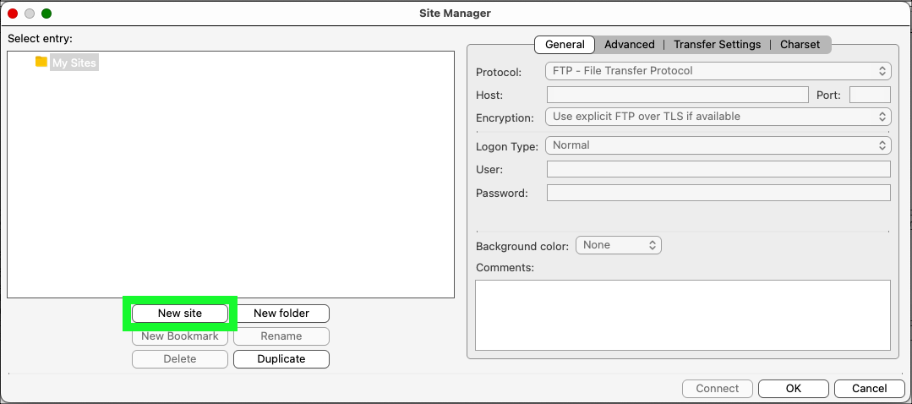
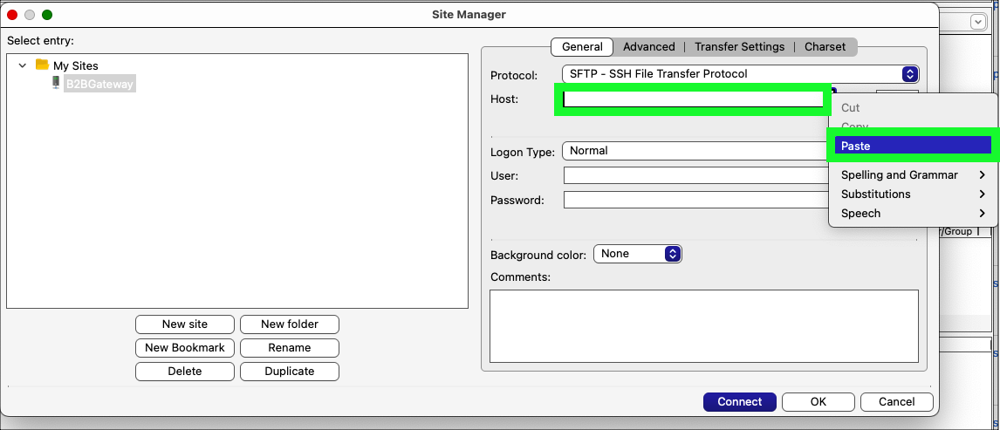
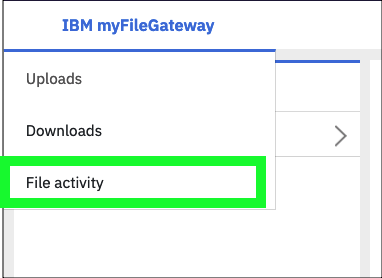
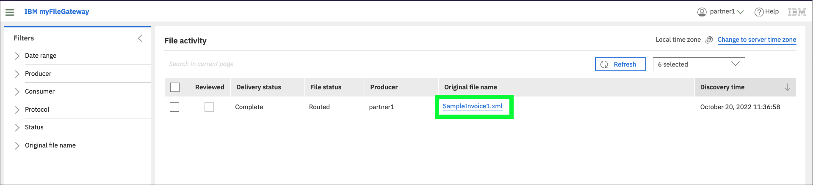

It is now time for the partners to transfer files between each other using the newly created B2Bi SFTP adapter, but first one last setup step to make the demonstration more visually exciting.

In this demonstration, the FileZilla application will be used. FileZilla is a free and open-source, cross-platform FTP application, consisting of FileZilla Client and FileZilla Server. Clients are available for Windows, Linux, and macOS. Learn more about FileZilla <a href="https://filezilla-project.org/" target="_blank">here</a>.

If users do not already have FileZilla installed, do so now. IBM employees can download FileZilla from the Mac@IBM store. For Business Partners and IBMers on Microsoft Windows, the download links are available at the link above.

If users are unable to use FileZilla, it is recommended to use the IBM Sterling File Gateway clients for both users in the scenario that follows. To avoid having to log in and out between user actions, it is recommended to use two different browsers (e.g. Chrome and Firefox) for each user or private/incognito windows for each user when accessing the IBM Sterling File Gateways.

When doing a client demonstration, it is recommended to split the FileZilla and browser windows on the same screen to avoid switching back and forth during the demonstration.

For this scenario, **partner1** will use the IBM Sterling File Gateway clients, and **partner2** will use FileZilla.

As an introduction, watch this brief video of the steps to be performed.

## Configure FileZilla for partner2

To configure FileZilla for **partner2** both the File Gateway route address and port number will be needed.

1. Return to the OpenShift web console and click on the **sterling-fg-b2bi-asi-internal-route** route on the **Routes** page.

2. Select the **Host** field, right click, and click **Copy**.

Note, the example below was captured using Firefox on MacOS. Others browser menus options may be labeled differently.

3. Open the FileZilla application on local computer.

4. Click the **FileZilla Site Manager**  icon.

5. Click the **New site** button.

6. Enter **B2BGateway** for the **New Site** name and press enter.

7. Select **SFTP - Secure File Transfer Protocol** on the **Protocol** pull-down menu.

8. Paste the **route** copied in step 2 into the **Host** field.

9. Enter the **port number** of the **sterling-fg-b2bi-asi-backend-svc** service in the **Port** field.

??? tip "Don't remember the port number?"
    The port number can be found in the details of the **sterling-fg-b2bi-asi-backend-svc** service in the OpenShift web console - use **adapters-1's** **Node port**.

    

10. Enter **partner2** in the **User** field and **password** in the **Password** field and click the **Connect** button.

11. Check the **Always trust this host, add this key to cache** checkbox and click **OK** on the **Unknown host key** pop-up window.

12. Notice the connection is established and the **Remote site** shows no files.

13. At this time, it is recommended to have both FileZilla and the OpenShift web console both visible at the same time (either split on a single screen or using multiple monitors).

14. Create or download the 2 sample files that will be transferred between partner1 and partner2. Since the templates created earlier allow for any file names to be transferred it does not matter what files are used.  It is suggested to use small files so the transfers happen quickly.  Feel free to download these two sample invoice files. In most browsers, select the link names below, right click on the links, and click **Save link as** to the local Downloads directory.

  - <a href="https://raw.githubusercontent.com/IBM/SalesEnablement-SterlingDataExchange-L3/main/tools/SampleInvoice1.xml" target="_blank">SampleInvoice1.xml</a>

  - <a href="https://raw.githubusercontent.com/IBM/SalesEnablement-SterlingDataExchange-L3/main/tools/SampleInvoice2.xml" target="_blank">SampleInvoice2.xml</a>

## Transfer a file from partner1 to partner2 using the IBM Sterling My File Gateway 2.0

15. In the OpenShift web console click the link to open the link to the **sterling-fg-b2bi-asi-internal-route-myfg** route.

16. Enter **partner1** in the **User name** field, **password** in the **Password** field, and then click **Log in**.

17. Click the hamburger menu icon  at top left and click **Uploads**.

18. Click the **/** directory in left-hand panel.

19. Click the **select** link in the **Upload to /** panel.

20. Click the **SampleInvoice1.xml** file in the **Downloads** directory and click **Open**.

!!! note "Note"
    Navigate to the directory where the sample invoice files were downloaded or pick another file to transfer. Do not transfer any file with confidential or personal information. The image above was captured using Firefox on MacOS, other browsers and operating system combinations may look different.

21. Verify in the **myFileGateway** application that the file transferred successfully.

22. Verify in **FileZilla** that **partner2** received the file.

If the file doesn't appear, click the **View** menu in the FileZilla menubar and then click **Refresh**. Note, you may need to click **Refresh** multiple times.

!!! note "Note"
    The file size shown in **IBM Sterling My File Gateway 2.0** is in kilobytes (KB) and in **FileZilla** the file size is displayed in bytes, but they are the same and the file transfer was successful.

It is important to realize the file has been transferred to the **B2Bi Gateway** repository. In a production environment, **partner2** would need to download the file. FileZilla is showing the contents of the data store on the gateway that **partner2** has permissions to see.

## View the details of the file transfer in **IBM Sterling My File Gateway 2.0**

23. Click **File activity** under the hamburger menu icon .

24. Click the link for the recently uploaded file: **SampleInvoice1.xml**.

25. Review the events that occurred during the file transfer.

Notice events **FG_0503** and **FG_0504** show the **Passthrough** channel template was used to properly route the transferred file to **partner2**.

??? question "BP quiz question"
    There is a quiz question related to the events of a successful file transfer. A screen capture of all the events and event numbers will help answer the question.

For additional demonstrations, consider the following:

- Transfer a file from **partner2** to **partner1**.
- Verify the file transfers using the **IBM Sterling File Gateway** application.
- Transfer a file using the older version of **IBM Sterling My File Gateway** using the **sterling-fg-b2bi-asi-internal-route-myfilegateway** route found in the OpenShift web console.
