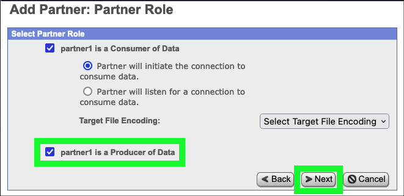
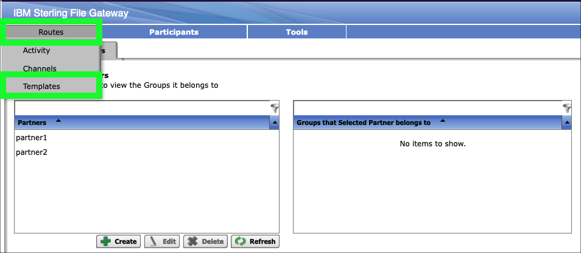
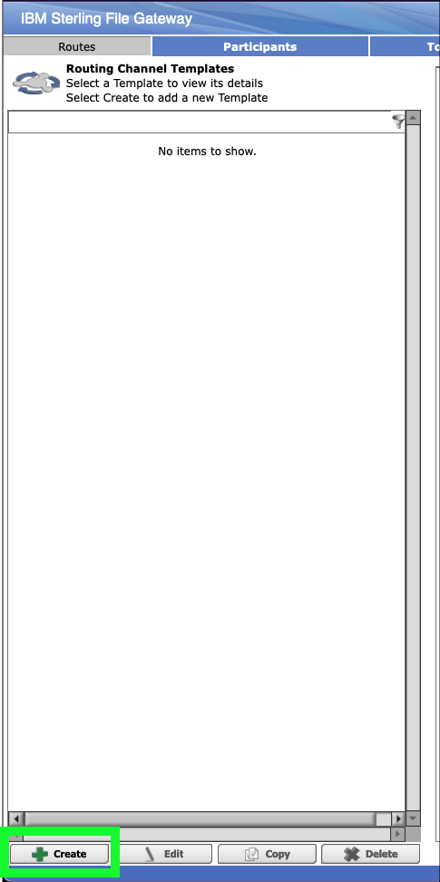
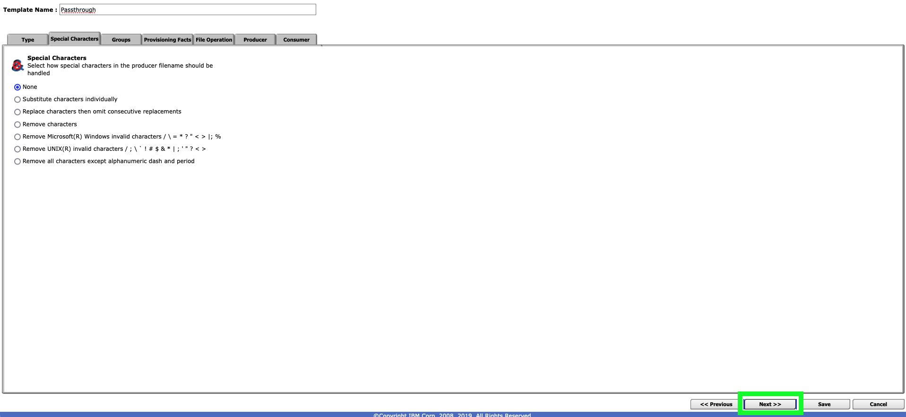
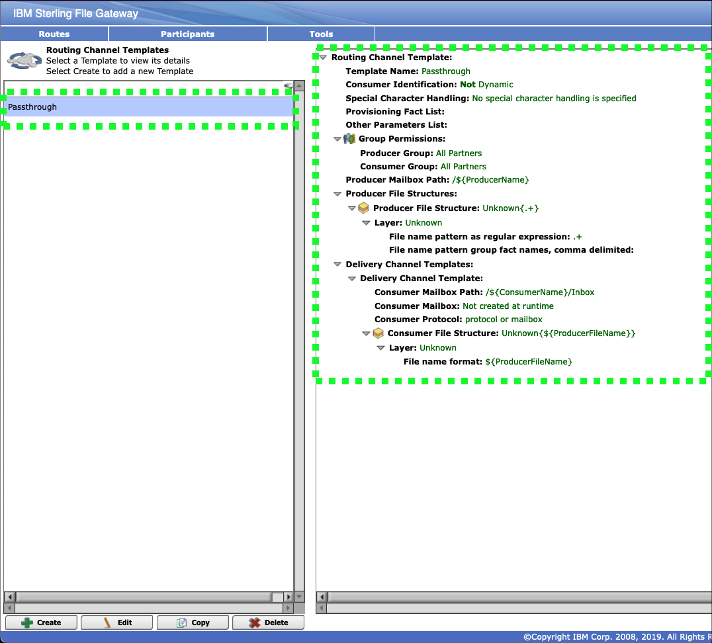
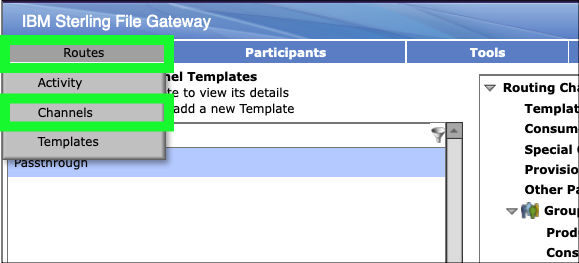
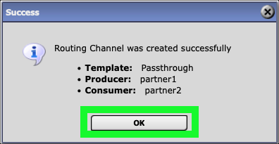

In this chapter, learn how to create a B2Bi partner community, add partners to the community, create a routing template, and create routing channels.

## Create a partner community

1. Return to the OpenShift web console and click on the route link to the IBM Sterling File Gateway user interface (UI): **sterling-fg-b2bi-asi-internal-route-filegateway**.


2. Enter **fg_sysadmin** in the User ID field, **password** in the Password field, and then click the **Sign In** button.


3. Click the **Participants** pull-down menu item on top menu bar.


4. Click **Communities** in the **Participants** menu.


5. In the **Communities** pop-up window, click the **add** link.


6. Enter **sftp_community** in the **Community Name** entry field and click **Next**.


7. Select both the **Partner Initiates Protocol Connections to Mailbox** and the **Partner Listens for Protocol Connections**.


8. Select the **SSH/SFTP** checkbox and click **Next**.


9. Click **Next** on the **Add Community: Notifications** form.


10. Click **Finish** to confirm the creation of the new community.


11. Click **Return** on the community confirmation screen.


## Add partners to the partner community

Next, add 2 partners to the newly created **sftp_community**.

12. Click the **edit** link for the **sftp_community** on the **Communities** pop-up window.


13. Under **Partner**, click the **Add** link.


14. Enter **partner1** in the **Partner Name** field, 10 digits in the **Phone** field, **partner1@localhost.com** in the **Email Address** field, and then click **Next**.


15. Enter **partner1** in the **User Name** field, **password** in the **Password** field, **password** in the **Confirm Password** field, **Partner** in the **Given Name** field, **One** in **Surname** field, and then click **Next**.


16. Click **partner1 is a Producer of Data** and then click **Next**.



17. Review the default settings on the **Initiate Connections Settings** screen and then click **Next**.


18. Review the default settings on the **PGP Settings** screen and then click **Next**.


19. Review the settings for **partner1** and click **Finish**.


20. Click **Return** on the **Added Partner Successful** screen.


21. Repeat the Steps 13 through 20 to create a second partner named **partner2** using the same settings.


22. Click **Return** on the **Edit Community: sftp_community** screen after creating both partners.


23. Close the **Communities** pop-up window.


24. Click **Partners** under the **Participants** menu.


25. Click the **Refresh** button if **partner1** and **partner2** do not appear in the **Partners** table.


## Create a routing template

26. Click **Templates** under the **Routes** menu.



27. Click the **Create** button at the bottom of the **Routing Channel Templates** page.



28. Enter **Passthrough** in the **Template Name** field and then click **Next>>**.


29. Review the **Special Characters** settings and then click **Next>>**.



30. Add **All Partners** to both the **Producer Groups** and **Consumer Groups** tables.


31. Click **Next>>** after adding **All Partners** to both groups.


32. Review the **Provisioning Facts** page and then click **Next>>**.


33. Review the **File Operation** page and then click **Next>>**.


34. Click the **Add** button on the **Producer** page.


35. Click the **Producer File Type** pull-down menu and select **Unknown**.


36. Enter **.+** in the **File name pattern as regular expression** field and then click **Save**.


Setting the file pattern to the regular expression **.+** allows for file names of one or more characters.

37. Click **Next>>** on the **Producer** page.


38. Click the **Add** button on the **Consumer** page.


39. Click the **Add** button on the **New Delivery Channel** pop-up window.


40. Click **Unknown** in the **Consumer File Type** pull-down menu.


41. Enter **${ProducerFileName}** in the **File name format*** field.

```
${ProducerFileName}
```

42. Review the help information regarding file name formats by hovering over the **File name format** entry field and then click **Save**.


43. Click **Save** on the **New Delivery Channel** pop-up window.


44. Click **Save** on the **Consumer** page.


45. Click **OK** on the **Routing Channel Template successfully created.** pop-up message.


46. Review the settings for the new **Passthrough** routing channel template.



## Create routing channels

47. Click the **Channels** option under the **Routes** menu.



48. Click the **Create** button at bottom right to create a new **Channel**.


49. Select **Passthrough** for the **Routing Channel Template**, **partner1** for the **Producer**, and **partner2** for the **Consumer**, and then click **Save** to create the new channel.


50. Click **OK** on the **Success** pop-up window.



51. Repeat the steps 48 through 50 to create a channel from partner2 to partner1.


52. Click **Sign Out**.


In the next chapter, the fun begins as the partners start to securely exchange files.
