This demonstration guide assumes a Red Hat OpenShift cluster running on VMware on IBM Cloud environment provisioned in IBM Technology Zone (ITZ) <a href="https://techzone.ibm.com/my/reservations/create/63a3a25a3a4689001740dbb3" target="_blank">here</a>.

At this point, all users should have completed the steps in the {{learningplan.name}} learning plan to reserve the Red Hat OpenShift environment as described in the {{learningplan.name}} <a href="https://ibm.seismic.com/Link/Content/DC8JQcd2PWDTR8fB2FmjmV3cPC8P" target="_blank">Introduction video</a>. Before proceeding, validate that the reservation has been fully provisioned and is in the **Ready** state in ITZ. If not, please complete those steps before proceeding.

!!! warning 

    Note, some screen captures below will show the name of the ITZ environment as **OpenShift Cluster (VMware on IBM Cloud) - IPI**. This demonstration script now uses the ITZ environment **OpenShift Cluster (VMware on IBM Cloud) - UPI**. 

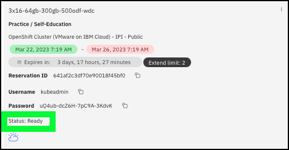

The following steps must be performed before delivering the demonstration. These steps should be performed well in advance of starting an actual client demonstration as it will take approximately **90 minutes** for all steps to complete.

## Access the OpenShift web console and verify the OpenShift cluster's health

1. From the <a href="http:https://techzone.ibm.com/my/reservations" target="_blank">ITZ My Reservations page</a>, click the tile for your OpenShift cluster reservation (must be in the **Ready** state).

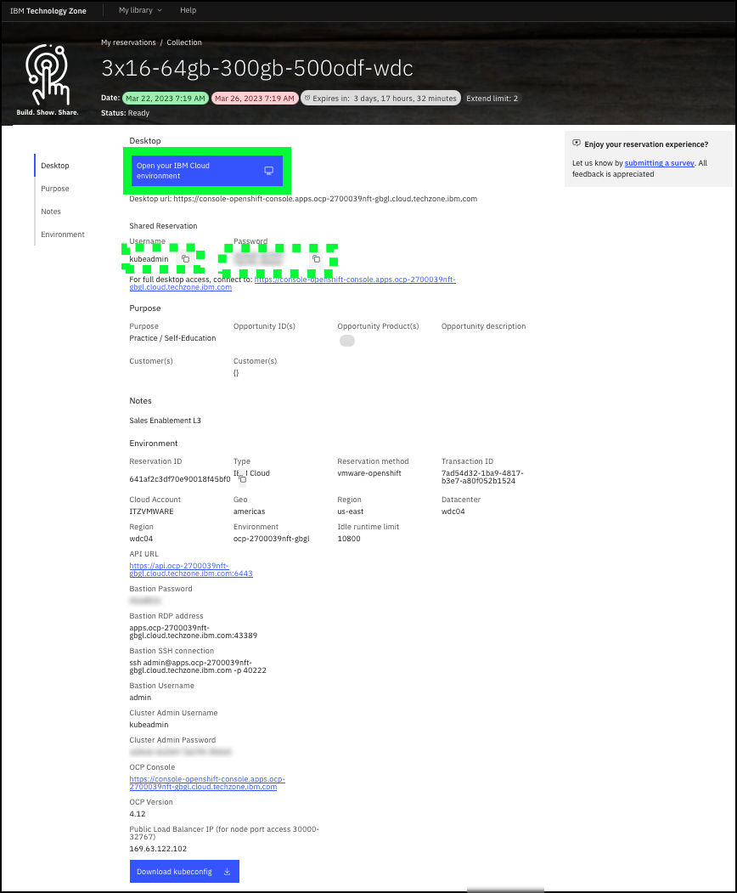

At this time, make note of the **Username** and **Password** fields under the **Shared Reservation** heading as highlighted above. You will need these values in the next steps.

2. Click the **Open your IBM Cloud environment**  button on the reservations detail page.

A new window or tab will open in your browser.

3. Enter the **Username** and **Password** for your OpenShift cluster (as described in step 1 above) and click the **Log in** button.

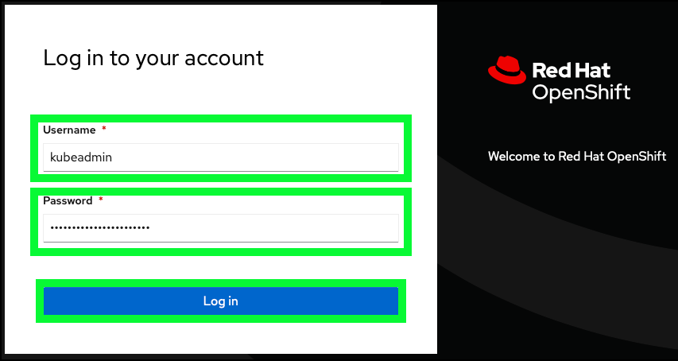

Before proceeding, verify that all {{tz_environment.numberOfWorkerNodes}} worker nodes were properly provisioned and available.

4. Click the **Compute** menu option in left-hand menu bar and then click the **Nodes** menu option.

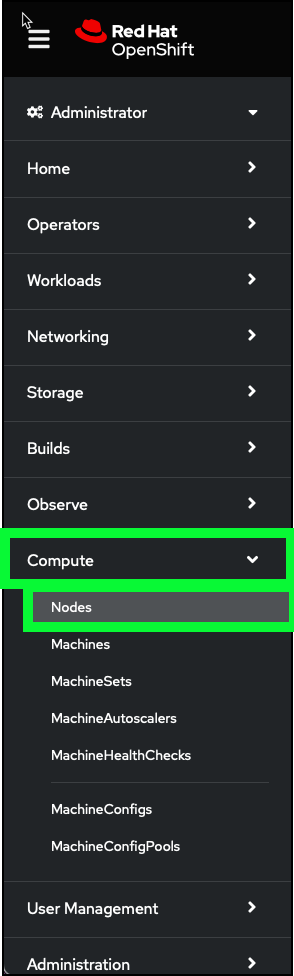

5. Observe the **Nodes** that have the role of **worker**.  There should be {{tz_environment.numberOfWorkerNodes}} of them with a status of **Ready**.

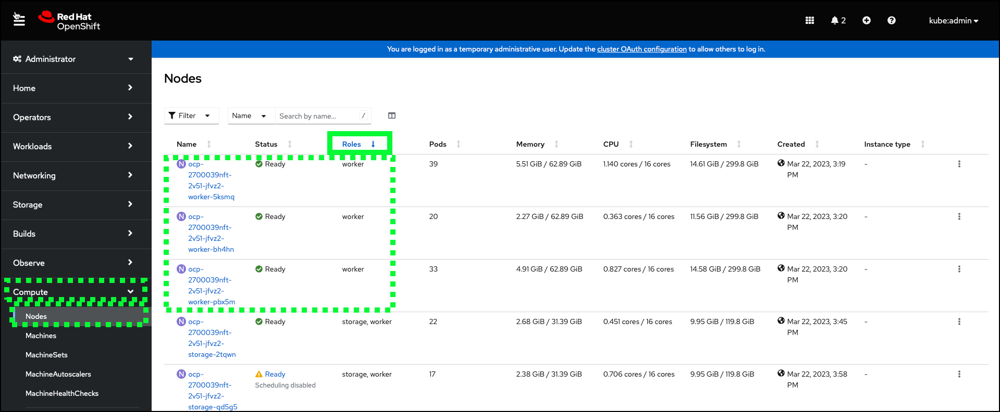

!!! error "Are less than {{tz_environment.numberOfWorkerNodes}} worker nodes available and  **Ready****?"
    
    If there are less than {{tz_environment.numberOfWorkerNodes}} worker nodes in the **Ready** state, it is
    very likely you will encounter issues during the installation of {{offering.name}}. It is highly recommended to delete the current ITZ reservation and create a new one following the earlier instructions. Alternatively, you can open a ticket with the ITZ support team using the <a href="" target="_blank">#itz-techzone-support</a> slack channel and see if the support team can fix the broken node(s).

## Access the **Bastion** server for the ITZ environment

In the next steps, you will access a virtual machine running in IBM Cloud referred to as a **Bastion** server. This server will be used to run various IBM Cloud, OpenShift, and other command line interfaces to install {{offering.name}} on the OpenShift cluster. 

To access the **Bastion** server, you must create a remote shell from your local workstation to the **Bastion** using a secure shell protocol client (ssh). Most operating systems (MacOS, Linux, Microsoft Windows) have an ssh client built in. There are also 3rd party and open source clients like <a href="https://www.putty.org" target="_blank">putty</a> that can be utilized.

The screen images that follow utilize the native MacOS ssh client running from a terminal window. Specific instructions for other operating systems are not provided, but should be similar.

6. Copy the **Bastion SSH connection** string for your ITZ reservation details page.

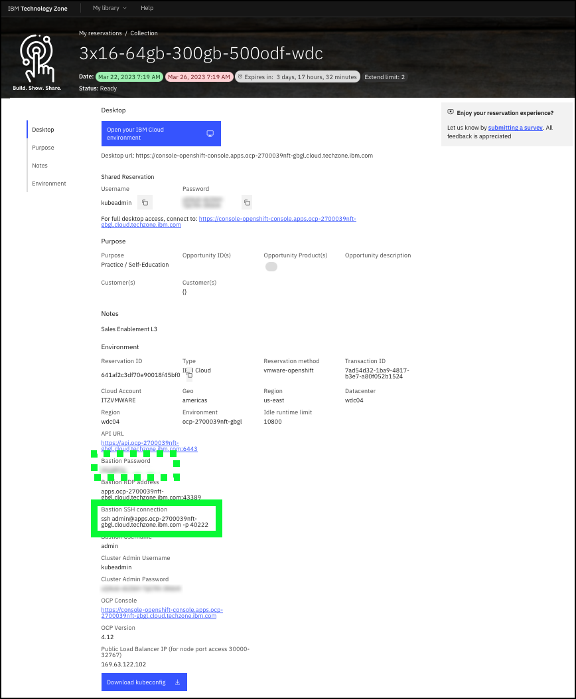

At this time, make note of the **Bastion Password** field as highlighted above. You will need this password in the next step.

7. Open a terminal or command line window on your local workstation.
8. In your local terminal or command line window, paste the **Bastion SSH connection** string and press enter.

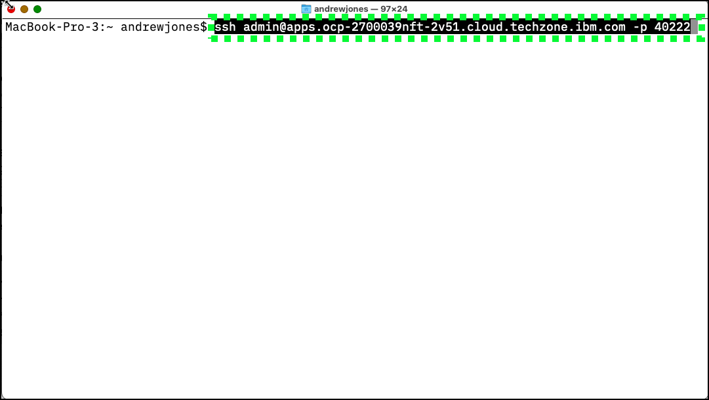

9. If prompted to accept the fingerprint, enter **yes**

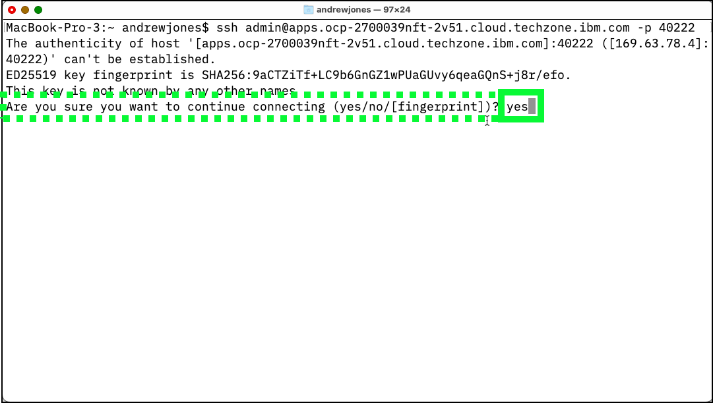

10. Enter the **Bastion Password** when prompted for a password.

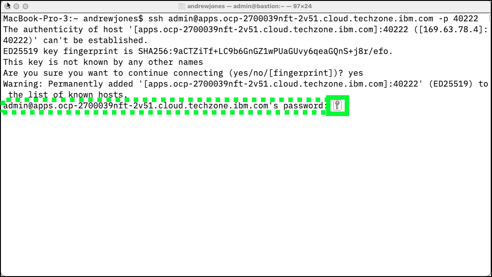

## Create install directory and retrieve the B2Bi installation scripts

11. Create a new directory for the B2Bi installation scripts.

```
mkdir b2bi
```

12. Set the **PROJECT_DIR** environment variable.

```
export PROJECT_DIR=$HOME/b2bi
```

13. Change directories to **PROJECT_DIR**.

```
cd $PROJECT_DIR
```

14. Download the B2Bi installation script.

```
wget -O {{b2bi.installScriptCloudShell}} {{gitRepo}}/{{b2bi.installPath}}/{{b2bi.installScriptCloudShell}}?raw=true
```

??? example "Example output"
    
    [admin@bastion b2bi]$  wget -O rapid-lab-b2bi-newdb-61051-CloudShell.zip https://github.com/IBM/SalesEnablement-SterlingDataExchange-L3/blob/main/tools/rapid-lab-b2bi-newdb-6122-ocpodf-bastion.zip?raw=true

    --2023-03-22 17:43:41--  https://github.com/IBM/SalesEnablement-SterlingDataExchange-L3/blob/main/tools/rapid-lab-b2bi-newdb-6122-ocpodf-bastion.zip?raw=true

    Resolving github.com (github.com)... 140.82.114.4

    Connecting to github.com (github.com)|140.82.114.4|:443... connected.

    HTTP request sent, awaiting response... 302 Found
    Location: https://github.com/IBM/SalesEnablement-SterlingDataExchange-L3/raw/main/tools/rapid-lab-b2bi-newdb-6122-ocpodf-bastion.zip [following]

    --2023-03-22 17:43:41--  https://github.com/IBM/SalesEnablement-SterlingDataExchange-L3/raw/main/tools/rapid-lab-b2bi-newdb-6122-ocpodf-bastion.zip

    Reusing existing connection to github.com:443.
    
    HTTP request sent, awaiting response... 302 Found

    Location: https://raw.githubusercontent.com/IBM/SalesEnablement-SterlingDataExchange-L3/main/tools/rapid-lab-b2bi-newdb-6122-ocpodf-bastion.zip [following]

    --2023-03-22 17:43:41--  https://raw.githubusercontent.com/IBM/SalesEnablement-SterlingDataExchange-L3/main/tools/rapid-lab-b2bi-newdb-6122-ocpodf-bastion.zip

    Resolving raw.githubusercontent.com (raw.githubusercontent.com)... 185.199.109.133, 185.199.110.133, 185.199.111.133, ...

    Connecting to raw.githubusercontent.com (raw.githubusercontent.com)|185.199.109.133|:443... connected.

    HTTP request sent, awaiting response... 200 OK

    Length: 26769 (26K) [application/zip]

    Saving to: ‘rapid-lab-b2bi-newdb-61051-CloudShell.zip’

    rapid-lab-b2bi-newdb-610 100%[===============================>]  26.14K  --.-KB/s    in 0s      

    2023-03-22 17:43:42 (98.2 MB/s) - ‘rapid-lab-b2bi-newdb-61051-CloudShell.zip’ saved [26769/26769]
    
    [admin@bastion b2bi]$ 


15. Unzip the installation script.

```
unzip {{b2bi.installScriptCloudShell}}
```

??? example "Example output"
    [admin@bastion b2bi]$ unzip rapid-lab-b2bi-newdb-61051-CloudShell.zip 

    Archive:  rapid-lab-b2bi-newdb-61051-CloudShell.zip
  
      inflating: COPYING                 
  
      inflating: README.md               
  
      inflating: deploy_b2bi.sh          
  
      inflating: deploy_db2.sh           
  
      inflating: deploy_mq.sh            
  
      inflating: edited-values.yaml      
  
      inflating: env.sh                  
  
      inflating: ocp-cli.sh              
  
      inflating: prepare_db2.sh          

    [admin@bastion b2bi]$ 

## Install the IBM Cloud command line interfaces (CLIs), OpenShift CLIs, and Helm

16. Run the **ocp-cli.sh** shell script to install the required tools.

```
./ocp-cli.sh
```

??? example "Example output"

    [admin@bastion b2bi]$ ./ocp-cli.sh 
    
    Installing ibmcloud utility. Wait!
    
    Installing Helm. Wait!

    Installing OpenShift oc utility. Wait!

    Installing Kubernetes kubectl. Wait!
    
    cleaning up. Wait!

    Checking versions

    Client Version: 4.11.31

    Kustomize Version: v4.5.4

    version.BuildInfo{Version:"v3.11.2", GitCommit:"912ebc1cd10d38d340f048efaf0abda047c3468e", GitTreeState:"clean", GoVersion:"go1.18.10"}

    Flag --short has been deprecated, and will be removed in the future. The --short output will become the default.

    Client Version: v1.24.11

    Kustomize Version: v4.5.4

    ibmcloud version 2.15.0+79fb346-2023-02-21T22:06:52+00:00

    [admin@bastion b2bi]$ 


## Authenticate to the OpenShift cluster

For the next steps, the **OpenShift** login command to authenticate to the OpenShift cluster must be retrieved and executed.

17. Switch to the **OpenShift web console** browser window or tab opened earlier.

18. Click the **IAM** identity drop-down menu at top right of the **OpenShift web console** and click the **Copy login command** option.

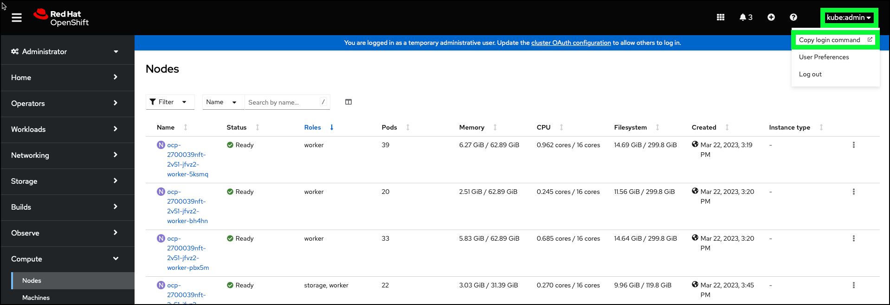

19. Click the **Display Token** link.


20. Copy the string in the **Log in with this token** field.


21. Switch back to the terminal with the open **ssh** session to the **Bastion** server.
22. Paste the **oc login** command line copied in step 20.

!!! example "Example output"
    
    [admin@bastion b2bi]$ oc login --token=sha256~KGOvFlJmXVd1UhyThw76v5TwGcv4FCMdnZIGJ6KJcaA --server=https://api.ocp-2700039nft-2v51.cloud.techzone.ibm.com:6443

    Logged into "https://api.ocp-2700039nft-2v51.cloud.techzone.ibm.com:6443" as "kube:admin" using the token provided.

    You have access to 71 projects, the list has been suppressed. You can list all projects with 'oc projects'

    Using project "default".

    Welcome! See 'oc help' to get started.

    [admin@bastion b2bi]$ 

## Install Db2 in the OpenShift cluster

23. Run the environment setup and Db2 deploy scripts.

```
. env.sh ; ./deploy_db2.sh
```

??? example "Example output"
    Now using project "db2" on server "https://c109-e.us-east.containers.cloud.ibm.com:30720".

    You can add applications to this project with the 'new-app' command. For example, try:

    oc new-app rails-postgresql-example

    to build a new example application in Ruby. Or use kubectl to deploy a simple Kubernetes application:

    kubectl create deployment hello-node --image=k8s.gcr.io/e2e-test-images/agnhost:2.33 -- /agnhost serve-hostname

    serviceaccount/db2 created
    clusterrole.rbac.authorization.k8s.io/system:openshift:scc:privileged added: "db2"
    secret/db2-secret created
    service/db2-ci created
    service/db2-lb created
    statefulset.apps/db2 created

!!! warning "Wait 5 minutes..."
    Wait approximately 5 minutes for the Db2 containers to start loading in OpenShift before executing the next step.

??? tip "Optional: monitor events in OpenShift web console"
    Use the OpenShift web console to monitor the **Db2** project events and pod creation.
    
    

24. Verify Db2 is up and running in the OpenShift cluster.

```
oc logs -f ${DB2_NAME}-0
```

!!! failure
    If no output is seen from the above command, or if it returns the following message:

    _Error from server (BadRequest): container "db2" in pod "db2-0" is waiting to start: ContainerCreating_

    wait and rerun oc logs -f ${DB2_NAME}-0 until the output starts steaming as shown in the example output below.

!!! example "Example output"
    (\*) Previous setup has not been detected. Creating the users...

    (\*) Creating users ...

    (\*) Creating instance ...

    DB2 installation is being initialized.

    Total number of tasks to be performed: 4
    Total estimated time for all tasks to be performed: 309 second(s)

    Task #1 start
    Description: Setting default global profile registry variables
    Task #1 end

    Task #2 start
    Description: Initializing instance list
    Estimated time 5 second(s)
    Task #2 end

    Task #3 start
    Description: Configuring DB2 instances
    Estimated time 300 second(s)
    Task #3 end

    Task #4 start
    Description: Updating global profile registry
    Estimated time 3 second(s)
    Task #4 end


        ...
        **Long output - truncated in this example**
        ...


    2022-10-18-16.44.43.180954+000 I33681E386            LEVEL: Warning
    PID     : 15858                TID : 139996146354048 PROC : db2start

    INSTANCE: db2inst1             NODE : 000

    HOSTNAME: db2-0

    FUNCTION: DB2 UDB, base sys utilities, sqleReleaseStStLockFile, probe:16078

    MESSAGE : Released lock on the file:

    DATA #1 : String, 50 bytes

    **/database/config/db2inst1/sqllib/ctrl/db2strst.lck**

!!! warning "Do not proceed until..."
    Do not proceed to the next step until the following line appears in the output:

    **/database/config/db2inst1/sqllib/ctrl/db2strst.lck**

25. Stop the **oc logs** command by entering ++ctrl++**+c** on the keyboard.

!!! example "Example output"
    ...
    FUNCTION: DB2 UDB, base sys utilities, sqleReleaseStStLockFile, probe:16078

    MESSAGE : Released lock on the file:

    DATA #1 : String, 50 bytes

    **/database/config/db2inst1/sqllib/ctrl/db2strst.lck**

    ^C

    itzuser@itz-2700039nft-srv4:~/b2bi$

## Configure Db2 and create the required B2Bi tables

26. Prepare the Db2 instance running in OpenShift.

```
./prepare_db2.sh
```

This script does not generate output.

27. Remotely connect to the Db2 container running in OpenShift.

```
oc rsh pod/${DB2_NAME}-0 su - db2inst1
```

!!! example "Example output"
    Last login: Tue Oct 18 20:47:33 UTC 2022

    [db2inst1@db2-0 ~]$

A remote connection is now open to the Db2 container running in OpenShift as shown by the change in the command prompt to: **[db2inst1@db2-0 ~]$**

28. Run the **db2reg.sh** script.

```
./db2reg.sh
```

??? example "Example output"
    DB20000I  The UPDATE DATABASE MANAGER CONFIGURATION command completed
    successfully.

    DB20000I  The UPDATE DATABASE MANAGER CONFIGURATION command completed
    successfully.

    DB20000I  The UPDATE DATABASE MANAGER CONFIGURATION command completed
    successfully.

    DB20000I  The UPDATE DATABASE MANAGER CONFIGURATION command completed
    successfully.

    DB20000I  The UPDATE DATABASE MANAGER CONFIGURATION command completed
    successfully.

    DB20000I  The UPDATE DATABASE MANAGER CONFIGURATION command completed
    successfully.

    DB20000I  The UPDATE DATABASE MANAGER CONFIGURATION command completed
    successfully.

    DB20000I  The UPDATE DATABASE MANAGER CONFIGURATION command completed
    successfully.

29. Create the B2Bi tables in Db2.

```
db2 -stvf create_scc_db_b2bidb.sql
```

!!! warning "This will take ~5 minutes"
    This command will take approximately 5 minutes to complete.

??? example "Example output"
    CREATE DATABASE B2BIDB AUTOMATIC STORAGE YES USING CODESET UTF-8 TERRITORY US COLLATE USING IDENTITY PAGESIZE 4096 DFT_EXTENT_SZ 32

    DB20000I  The CREATE DATABASE command completed successfully.

    CONNECT TO B2BIDB

       Database Connection Information

     Database server        = DB2/LINUXX8664 11.5.5.1
     SQL authorization ID   = DB2INST1
     Local database alias   = B2BIDB

    UPDATE DATABASE CONFIG USING STMT_CONC LITERALS

    DB20000I  The UPDATE DATABASE CONFIGURATION command completed successfully.

    ...
    **Long output - truncated in this example**
    ...

    CREATE USER TEMPORARY TABLESPACE UTEMP4KTS IN DATABASE PARTITION GROUP IBMDEFAULTGROUP PAGESIZE 4 K MANAGED BY AUTOMATIC STORAGE EXTENTSIZE 32 BUFFERPOOL UTEMP4KBP FILE SYSTEM CACHING

    DB20000I  The SQL command completed successfully.

    CONNECT RESET

    DB20000I  The SQL command completed successfully.

30. Run the final Db2 update script.

```
./db2-update.sh
```

??? example "Example output"
    Database Connection Information

    Database server        = DB2/LINUXX8664 11.5.5.1
    SQL authorization ID   = DB2INST1
    Local database alias   = B2BIDB

    DB20000I  The SQL command completed successfully.
    DB20000I  The TERMINATE command completed successfully.
    DB20000I  The FORCE APPLICATION command completed successfully.
    DB21024I  This command is asynchronous and may not be effective immediately.

    DB20000I  The DEACTIVATE DATABASE command completed successfully.

    10/18/2022 16:53:39     0   0   SQL1064N  DB2STOP processing was successful.

    SQL1064N  DB2STOP processing was successful.

    10/18/2022 16:53:41     0   0   SQL1063N  DB2START processing was successful.

    SQL1063N  DB2START processing was successful.

31. Exit the connection to the Db2 container in OpenShift.

```
exit
```

Notice the command line prompt has changed back to the prompt for the **ssh** session to the **Bastion** server.

## Install MQ in the OpenShift cluster

32. Deploy MQ to OpenShift.

```
./deploy_mq.sh
```

??? example "Example output"
    Now using project "mq" on server "https://c109-e.us-east.containers.cloud.ibm.com:30720".

    You can add applications to this project with the 'new-app' command. For example, try:

       oc new-app rails-postgresql-example

    to build a new example application in Ruby. Or use kubectl to deploy a simple Kubernetes application:

      kubectl create deployment hello-node --image=k8s.gcr.io/e2e-test-images/agnhost:2.33 -- /agnhost serve-hostname

    serviceaccount/mq created
    clusterrole.rbac.authorization.k8s.io/system:openshift:scc:privileged added: "mq"
    service/mq-data created
    service/mq-web created

    W1018 16:54:39.757566   34060 shim_kubectl.go:58] Using non-groupfied API resources is deprecated and will be removed in a future release, update apiVersion to "route.openshift.io/v1" for your resource

    route.route.openshift.io/mq-web created

    secret/mq-secret created

    statefulset.apps/mq created

## Update the environment variables with IBM container entitlement key and e-mail address

The next steps require editing of a file using the **vi** editor. If you are not familiar with the **vi** editor, it is strongly recommend to watch the following video before proceeding. There is no audio for this video.


33. Open the **vi** editor.

```
vi  env.sh
```

34. Open the IBM **Entitlement key** page <a href="https://myibm.ibm.com/products-services/containerlibrary" target="_blank">here</a>.

<!-- https://www.ibm.com/partnerworld/program/benefits/partner-package -->

Note, re-authentication to ibm.com may be required.

35. If an entitlement key does not already exist, click **Add new key**.


36. Click the **Copy** button.


37. Return to the IBM Cloud Shell window, use the arrow keys to move the cursor between the quotes in the **export APIKEY** line, press **i** to enter input mode, and paste the copied **entitlement key** between the quotes.
38. Press the **esc** key to exit input mode.
39. Arrow key down and over to between the quotes in the **export EMAIL=""** line, press **i** to enter input mode, and enter a your e-mail address.
40. Press the **esc** key to exit input mode.
41. Press the **:** key and then the **x** key and enter to save and exit the **vi** editor.
42. Verify the env.sh file looks like the example output below.

```
cat env.sh
```

!!! example "Example output"
    itzuser@itz-2700039nft-srv4:~/b2bi$ cat env.sh

    \#!/usr/bin/bash

    \#\# Locate your APIKEY (Entitlement Key For Container Software)

    \#\# here: https://myibm.ibm.com/products-services/containerlibrary

    \#\# Requires IBM ID and permission.

    export PROJECT_NAME="b2bi"

    export PROJECT_DIR="$HOME/b2bi"

    export DB2_NAME="db2"

    export MQ_NAME="mq"

    export APIKEY="XXXXXXXXXXXXXXXXXXXXXXXXXXXXXXXXXXXXXXXXXXXXXXXXXXXXXX"

    export EMAIL="andrew@jones-tx.com"

    itzuser@itz-2700039nft-srv4:~/b2bi$


## Install B2Bi in the OpenShift cluster

43. Deploy the B2Bi related containers on OpenShift.

```
./deploy_b2bi.sh
```

!!! warning "This will take approximately 70 minutes"
    This script will take approximately 70 minutes to complete.

??? tip "Optional: monitor events in the OpenShift web console"
    Use the OpenShift web console to monitor the **b2bi** project events and pod creation.
    
    

??? example "Example output beginning."
    Now using project "b2bi" on server "https://c103-e.us-south.containers.cloud.ibm.com:31501".

    You can add applications to this project with the 'new-app' command. For example, try:

      oc new-app rails-postgresql-example

    to build a new example application in Ruby. Or use kubectl to deploy a simple Kubernetes application:

      kubectl create deployment hello-node --image=k8s.gcr.io/e2e-test-images/agnhost:2.33 -- /agnhost serve-hostname

    ...
    **Long output - truncated in this example**
    ...

    ibm-b2bi-prod/charts/ibm-sch/ibm_cloud_pak/pak_extensions/pre-install/namespace-administration/role.yaml

    ibm-b2bi-prod/charts/ibm-sch/ibm_cloud_pak/pak_extensions/pre-install/namespace-administration/rolebinding.yaml
    
    ibm-b2bi-prod/charts/ibm-sch/ibm_cloud_pak/pak_extensions/pre-install/namespace-administration/serviceaccount.yaml

    ibm-b2bi-prod/charts/ibm-sch/ibm_cloud_pak/pak_extensions/pre-install/namespace-administration/setupNamespace.sh

??? example "Example output ending."
    ...
    **Long output - truncated in this example**
    ...
  
    NAME: sterling-fg

    LAST DEPLOYED: Wed Mar 22 18:06:32 2023

    NAMESPACE: b2bi
    
    STATUS: deployed
    
    REVISION: 1

    NOTES:

    Please wait while the application is getting deployed.

    1. Run the below command to check the status of application server replica sets. At least 1 replica must be in 'READY' state. 
 
      kubectl get replicasets -l release=sterling-fg -n b2bi

    2. Run the below command to check the status of the application 
    server pods for the release.
  
      kubectl get pods -l release=sterling-fg -n b2bi -o wide

    To view the logs for a pod, run the below command.
  
      kubectl logs <pod name> -n b2bi

    3. Access the application by running the following url

    ----------------------------------------------------------------------------------------------------------------

    Below app defined PVC name configuration will be deprecated in future release

Do not close the **ssh** session or the terminal window until the command completes. Once the command  successfully completes, the **ssh** session can be closed (type **exit** at the command prompt or simply close the terminal window).

## Verify all three B2Bi **pods** are running in OpenShift

44. Return to the OpenShift web console window in your browser.
45. Click the **Home** menu on the right-hand menu bar, and then click **Projects**.

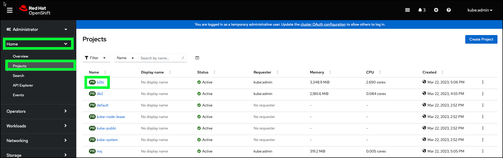

46. Click the **b2bi** project link.
47. Click the **Pods** link under **Inventory**.

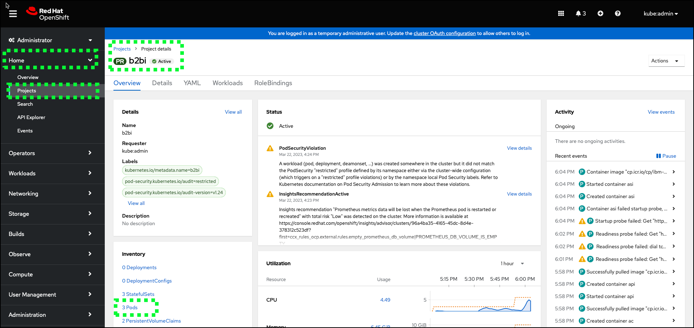

There should be 3 **pods** in the **b2bi** project. The **pods** will go through various states while starting up. Do not proceed to the next chapter until all 3 **pods** have a **Status** of **Running** AND the **Ready** column shows **1/1** for each **pod**! Note, it may take several minutes for the **sterling-fg-b2bi-asi-server-0** pod to change the **Ready** state from **0/1** to **1/1**. You may observe this **pod** restarting multiple times.  This is normal, just be patient.

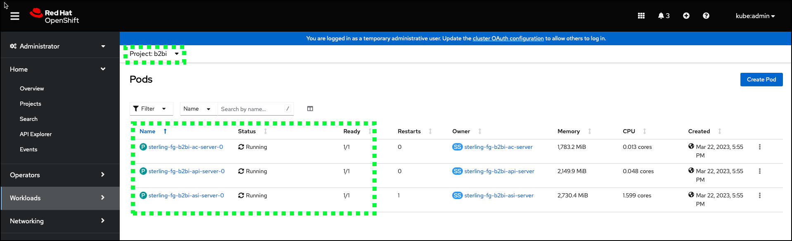

That concludes the setup of the environment. Proceed to the next part of the demonstration guide to configure B2Bi.
