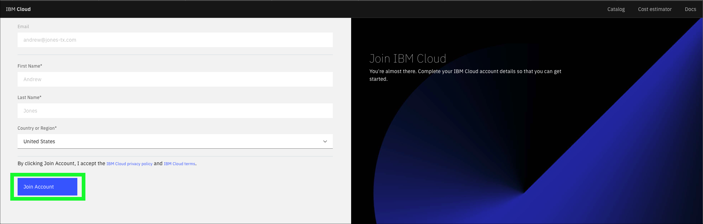
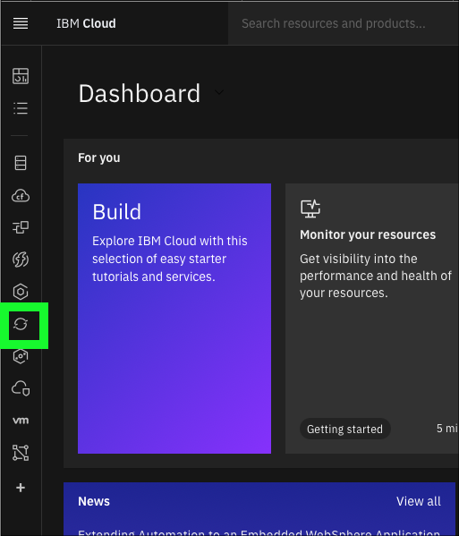
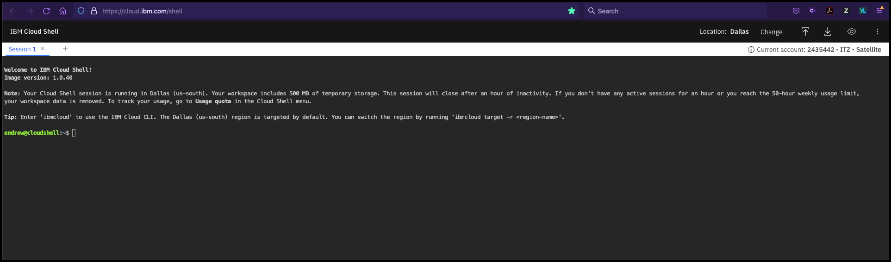
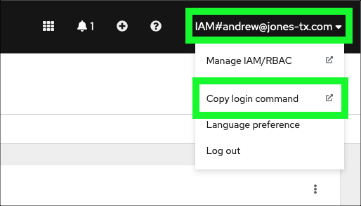
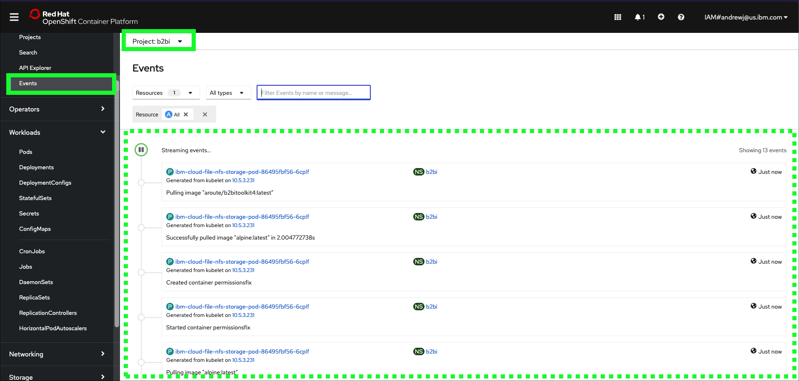

This demonstration guide assumes a **Custom ROKS** environment provisioned from IBM Technology Zone (ITZ) <a href="https://techzone.ibm.com/my/reservations/create/63c0182dec7e9b0018b4f6bf" target="_blank">here</a>.

At this point, all users should have completed the steps in the {{learningplan.name}} learning plan to reserve the Red Hat OpenShift on IBM Cloud environment as described in the {{learningplan.name}} <a href="https://ibm.seismic.com/Link/Content/DC8JQcd2PWDTR8fB2FmjmV3cPC8P" target="_blank">Introduction video</a>. Before proceeding, validate that the reservation has been fully provisioned and is in the **Ready** state in ITZ. If not, please complete those steps before proceeding.


The following steps must be performed before delivering the demonstration. These steps should be performed well in advance of starting an actual client demonstration as it will take approximately 90 minutes for all steps to complete.

## Accept invitation to join the ITZ IBM Cloud account for the Custom ROKS reservation

1. Open the **You are invited to join an account in IBM Cloud** email received from IBM Cloud and click the **Join now** link.


??? error "Did not get an e-mail from IBM Cloud?"

    If you did not receive an e-mail from IBM Cloud inviting you to join the {{tz_environment.cloudAccount}}, but you did receive a notification from ITZ that your environment was ready, try the following:

    - Log into cloud.ibm.com using your IBM Cloud ID.
    - Click the .
    - Look for a new notification with the subject: **Action required: You are invited to join an account in IBM Cloud**.
    - Click on the notification and then click the **Join now** link.

    If you do not see a notification or an e-mail, try deleting the existing reservation in ITZ and try creating a new one. If that doesn't work, open a support ticket in the #itz-techzone-support Slack channel.  Include the reservation ID and summarize the problem in your message.

1. In the browser window that opens, click the **Join Account** button.



Follow the steps to login to IBM Cloud.

3. On the **IBM Cloud Dashboard** set the current account to **{{tz_environment.cloudAccount}}**.


??? failure "Not seeing {{tz_environment.cloudAccount}}?"
    It is possible ITZ provisioned the OpenShift cluster in a different IBM Cloud account. Select the account specified in the ITZ reservation.
    

## Access the OpenShift web console

4. Click the **OpenShift**  icon in the left-hand menu bar.



5. Click **Clusters**.


6. Click the OpenShift cluster name in the table.


Note: the cluster name will be different than seen in the above image.

7. Click the **OpenShift web console** button.


At this time, a page like the one below should open in a new browser window or tab.


Leave this browser window open. It will be used again later.

## Retrieve the B2Bi installation scripts

In this part of the demonstration, you will use the IBM Cloud Shell. If you are not familiar with IBM Cloud Shell, you can learn about it <a href="https://cloud.ibm.com/docs/cloud-shell?topic=cloud-shell-getting-started" target="_blank">here</a>.

!!! warning
    It is critical all steps in this section be completed in a single instance of IBM Cloud Shell. If the shell becomes inactive for more than 20 minutes, it will be closed. Additionally, local files will not persist after 2 hours of inactivity. In this section, files are downloaded, modified, and long running commands are executed. Please allot approximately 90 continuous minutes to complete this section of the demonstration script. Note, the last step is a long running (~60 minutes) automated script. Once started, keep the Cloud Shell browser window/tab open and allow the process to complete. No further user interaction will be required once it is started. **Not completing this section in a single instance of IBM Cloud Shell will leave the B2Bi deployment to OpenShift in an inconsistent state. A new ITZ environment will need to be provisioned and this section will need to be re-executed.**

!!! tip
    Use the **copy** capability of the demonstration guide to copy and paste commands to the IBM Cloud Command Shell to avoid typing errors.

8. In the IBM Cloud Portal, with the demonstration account selected (**{{tz_environment.cloudAccount}}**), click the IBM Cloud Shell icon.


The IBM Cloud Shell will open in a new browser tab or window. It may take a few seconds for the shell to initialize.



9. Create a new directory for the B2Bi installation scripts.

```
mkdir b2bi
```

10. Set the **PROJECT_DIR** environment variable.

```
export PROJECT_DIR=$HOME/b2bi
```

11. Change directories to **PROJECT_DIR**.

```
cd $PROJECT_DIR
```

12. Download the B2Bi installation script.

```
wget -O {{b2bi.installScriptCloudShell}} {{gitRepo}}/{{b2bi.installPath}}/{{b2bi.installScriptCloudShell}}?raw=true
```

??? example "Example output"
    --2022-10-18 20:12:56--  https://github.com/IBM/SalesEnablement-SterlingDataExchange-L3/blob/main/tools/rapid-lab-b2bi-newdb-61051.zip?raw=true

    Resolving github.com (github.com)... 140.82.113.4

    Connecting to github.com (github.com)|140.82.113.4|:443... connected.

    HTTP request sent, awaiting response... 302 Found

    Location: https://github.com/IBM/SalesEnablement-SterlingDataExchange-L3/raw/main/tools/rapid-lab-b2bi-newdb-61051.zip [following]

    --2022-10-18 20:12:56--  https://github.com/IBM/SalesEnablement-SterlingDataExchange-L3/raw/main/tools/rapid-lab-b2bi-newdb-61051.zip

    Reusing existing connection to github.com:443.

    HTTP request sent, awaiting response... 302 Found

    Location: https://raw.githubusercontent.com/IBM/SalesEnablement-SterlingDataExchange-L3/main/tools/rapid-lab-b2bi-newdb-61051.zip [following]

    --2022-10-18 20:12:57--  https://raw.githubusercontent.com/IBM/SalesEnablement-SterlingDataExchange-L3/main/tools/rapid-lab-b2bi-newdb-61051.zip

    Resolving raw.githubusercontent.com (raw.githubusercontent.com)... 185.199.110.133, 185.199.111.133, 185.199.108.133, ...

    Connecting to raw.githubusercontent.com (raw.githubusercontent.com)|185.199.110.133|:443... connected.

    HTTP request sent, awaiting response... 200 OK

    Length: 4061226 (3.9M) [application/zip]

    Saving to: ‘rapid-lab-b2bi-newlab-61051.zip’

    rapid-lab-b2bi-newlab-61051.zip                             100%[=========================================================================================================================================>]   3.87M  --.-KB/s    in 0.03s

    2022-10-18 20:12:57 (147 MB/s) - ‘rapid-lab-b2bi-newlab-61051.zip’ saved [4061226/4061226]

13. Unzip the installation script.

```
unzip {{b2bi.installScriptCloudShell}}
```

??? example "Example output"
    Archive:  {{b2bi.installScriptCloudShell}}

      inflating: deploy_mq.sh

      inflating: edited-values.yaml

      inflating: prepare_db2.sh

      inflating: deploy_db2.sh

      inflating: README.md

      inflating: COPYING

      inflating: env.sh

      inflating: deploy_b2bi.sh

      inflating: db2jcc4.jar

## Authenticate to the OpenShift cluster

For the next steps, the **OpenShift** login command to authenticate to the OpenShift cluster must be retrieved and executed.

14. Switch to the **OpenShift web console** browser window or tab.


15. Click the **IAM** identity drop-down menu at top right of the **OpenShift web console** and click the **Copy login command** option.



16. Click the **Display Token** link.


17. Copy the string in the **Log in with this token** field.


18. Switch back to the IBM Cloud Shell browser window or tab from earlier.
19. Paste the **oc login** command line copied in step 17 into the IBM Cloud Shell window and press enter.

!!! example "Example output"
    itzuser@itz-2700039nft-srv4:~/b2bi$ oc login --token=sha256~XXXXXXXXXXXXXXXXXX --server=https://c103-e.us-south.containers.cloud.ibm.com:31501

    Logged into "https://c103-e.us-south.containers.cloud.ibm.com:31501" as "IAM#andrew@jones-tx.com" using the token provided.

    You have access to 66 projects, the list has been suppressed. You can list all projects with 'oc projects'

    Using project "default".

    Welcome! See 'oc help' to get started.

    itzuser@itz-2700039nft-srv4:~/b2bi$

## Install Db2 in the OpenShift cluster

20. Run the environment setup and Db2 deploy scripts.

```
. env.sh ; ./deploy_db2.sh
```

??? example "Example output"
    Now using project "db2" on server "https://c109-e.us-east.containers.cloud.ibm.com:30720".

    You can add applications to this project with the 'new-app' command. For example, try:

    oc new-app rails-postgresql-example

    to build a new example application in Ruby. Or use kubectl to deploy a simple Kubernetes application:

    kubectl create deployment hello-node --image=k8s.gcr.io/e2e-test-images/agnhost:2.33 -- /agnhost serve-hostname

    serviceaccount/db2 created
    clusterrole.rbac.authorization.k8s.io/system:openshift:scc:privileged added: "db2"
    secret/db2-secret created
    service/db2-ci created
    service/db2-lb created
    statefulset.apps/db2 created

!!! warning "Wait 5 minutes..."
    Wait approximately 5 minutes for the Db2 containers to start loading in OpenShift before executing the next step.

??? tip "Optional: monitor events in OpenShift web console"
    Use the OpenShift web console to monitor the **Db2** project events and pod creation.
    
    

21. Verify Db2 is up and running in the OpenShift cluster.

```
oc logs -f ${DB2_NAME}-0
```

!!! failure
    If no output is seen from the above command, or if it returns the following message:

    _Error from server (BadRequest): container "db2" in pod "db2-0" is waiting to start: ContainerCreating_

    wait and rerun oc logs -f ${DB2_NAME}-0 until the output starts steaming as shown in the example output below.

!!! example "Example output"
    (\*) Previous setup has not been detected. Creating the users...

    (\*) Creating users ...

    (\*) Creating instance ...

    DB2 installation is being initialized.

    Total number of tasks to be performed: 4
    Total estimated time for all tasks to be performed: 309 second(s)

    Task #1 start
    Description: Setting default global profile registry variables
    Task #1 end

    Task #2 start
    Description: Initializing instance list
    Estimated time 5 second(s)
    Task #2 end

    Task #3 start
    Description: Configuring DB2 instances
    Estimated time 300 second(s)
    Task #3 end

    Task #4 start
    Description: Updating global profile registry
    Estimated time 3 second(s)
    Task #4 end


        ...
        **Long output - truncated in this example**
        ...


    2022-10-18-16.44.43.180954+000 I33681E386            LEVEL: Warning
    PID     : 15858                TID : 139996146354048 PROC : db2start

    INSTANCE: db2inst1             NODE : 000

    HOSTNAME: db2-0

    FUNCTION: DB2 UDB, base sys utilities, sqleReleaseStStLockFile, probe:16078

    MESSAGE : Released lock on the file:

    DATA #1 : String, 50 bytes

    **/database/config/db2inst1/sqllib/ctrl/db2strst.lck**

!!! warning "Do not proceed until..."
    Do not proceed to the next step until the following line appears in the output:

    **/database/config/db2inst1/sqllib/ctrl/db2strst.lck**

22. Stop the **oc logs** command by entering ++ctrl++**+c** on the keyboard.

!!! example "Example output"
    ...
    FUNCTION: DB2 UDB, base sys utilities, sqleReleaseStStLockFile, probe:16078

    MESSAGE : Released lock on the file:

    DATA #1 : String, 50 bytes

    **/database/config/db2inst1/sqllib/ctrl/db2strst.lck**

    ^C

    itzuser@itz-2700039nft-srv4:~/b2bi$

## Configure Db2 and create the required B2Bi tables

23. Prepare the Db2 instance running in OpenShift.

```
./prepare_db2.sh
```

This script does not generate output.

36. Remotely connect to the Db2 container running in OpenShift.

```
oc rsh pod/${DB2_NAME}-0 su - db2inst1
```

!!! example "Example output"
    Last login: Tue Oct 18 20:47:33 UTC 2022

    [db2inst1@db2-0 ~]$

A remote connection is now open to the Db2 container running in OpenShift as shown by the change in the command prompt to: **[db2inst1@db2-0 ~]$**

24. Run the **db2reg.sh** script.

```
./db2reg.sh
```

??? example "Example output"
    DB20000I  The UPDATE DATABASE MANAGER CONFIGURATION command completed
    successfully.

    DB20000I  The UPDATE DATABASE MANAGER CONFIGURATION command completed
    successfully.

    DB20000I  The UPDATE DATABASE MANAGER CONFIGURATION command completed
    successfully.

    DB20000I  The UPDATE DATABASE MANAGER CONFIGURATION command completed
    successfully.

    DB20000I  The UPDATE DATABASE MANAGER CONFIGURATION command completed
    successfully.

    DB20000I  The UPDATE DATABASE MANAGER CONFIGURATION command completed
    successfully.

    DB20000I  The UPDATE DATABASE MANAGER CONFIGURATION command completed
    successfully.

    DB20000I  The UPDATE DATABASE MANAGER CONFIGURATION command completed
    successfully.

25. Create the B2Bi tables in Db2.

```
db2 -stvf create_scc_db_b2bidb.sql
```

!!! warning "This will take ~5 minutes"
    This command will take approximately 5 minutes to complete.

??? example "Example output"
    CREATE DATABASE B2BIDB AUTOMATIC STORAGE YES USING CODESET UTF-8 TERRITORY US COLLATE USING IDENTITY PAGESIZE 4096 DFT_EXTENT_SZ 32

    DB20000I  The CREATE DATABASE command completed successfully.

    CONNECT TO B2BIDB

       Database Connection Information

     Database server        = DB2/LINUXX8664 11.5.5.1
     SQL authorization ID   = DB2INST1
     Local database alias   = B2BIDB

    UPDATE DATABASE CONFIG USING STMT_CONC LITERALS

    DB20000I  The UPDATE DATABASE CONFIGURATION command completed successfully.

    ...
    **Long output - truncated in this example**
    ...

    CREATE USER TEMPORARY TABLESPACE UTEMP4KTS IN DATABASE PARTITION GROUP IBMDEFAULTGROUP PAGESIZE 4 K MANAGED BY AUTOMATIC STORAGE EXTENTSIZE 32 BUFFERPOOL UTEMP4KBP FILE SYSTEM CACHING

    DB20000I  The SQL command completed successfully.

    CONNECT RESET

    DB20000I  The SQL command completed successfully.

26. Run the final Db2 update script.

```
./db2-update.sh
```

??? example "Example output"
    Database Connection Information

    Database server        = DB2/LINUXX8664 11.5.5.1
    SQL authorization ID   = DB2INST1
    Local database alias   = B2BIDB

    DB20000I  The SQL command completed successfully.
    DB20000I  The TERMINATE command completed successfully.
    DB20000I  The FORCE APPLICATION command completed successfully.
    DB21024I  This command is asynchronous and may not be effective immediately.

    DB20000I  The DEACTIVATE DATABASE command completed successfully.

    10/18/2022 16:53:39     0   0   SQL1064N  DB2STOP processing was successful.

    SQL1064N  DB2STOP processing was successful.

    10/18/2022 16:53:41     0   0   SQL1063N  DB2START processing was successful.

    SQL1063N  DB2START processing was successful.

27. Exit the connection to the Db2 container in OpenShift.

```
exit
```

??? example "Example output"
    logout
    itzuser@itz-2700039nft-srv4:~/b2bi$

Notice the command line prompt has changed back to the prompt for IBM Cloud Shell.

## Install MQ in the OpenShift cluster

28. Deploy MQ to OpenShift.

```
./deploy_mq.sh
```

??? example "Example output"
    Now using project "mq" on server "https://c109-e.us-east.containers.cloud.ibm.com:30720".

    You can add applications to this project with the 'new-app' command. For example, try:

       oc new-app rails-postgresql-example

    to build a new example application in Ruby. Or use kubectl to deploy a simple Kubernetes application:

      kubectl create deployment hello-node --image=k8s.gcr.io/e2e-test-images/agnhost:2.33 -- /agnhost serve-hostname

    serviceaccount/mq created
    clusterrole.rbac.authorization.k8s.io/system:openshift:scc:privileged added: "mq"
    service/mq-data created
    service/mq-web created

    W1018 16:54:39.757566   34060 shim_kubectl.go:58] Using non-groupfied API resources is deprecated and will be removed in a future release, update apiVersion to "route.openshift.io/v1" for your resource

    route.route.openshift.io/mq-web created

    secret/mq-secret created

    statefulset.apps/mq created

## Update the environment variables with IBM container entitlement key and e-mail address

The next steps require editing of a file using the **vi** editor. If you are not familiar with the **vi** editor, it is strongly recommend to watch the following video before proceeding. There is no audio for this video.


29. Open the **vi** editor.

```
vi  env.sh
```

30. Open the IBM **Entitlement key** page <a href="https://myibm.ibm.com/products-services/containerlibrary" target="_blank">here</a>.

<!-- https://www.ibm.com/partnerworld/program/benefits/partner-package -->

Note, re-authentication to ibm.com may be required.

31. If an entitlement key does not already exist, click **Add new key**.


32. Click the **Copy** button.


33. Return to the IBM Cloud Shell window, use the arrow keys to move the cursor between the quotes in the **export APIKEY** line, press **i** to enter input mode, and paste the copied **entitlement key** between the quotes.
34. Press the **esc** key to exit input mode.
35. Arrow key down and over to between the quotes in the **export EMAIL=""** line and enter a your e-mail address.
36. Press the **esc** key to exit input mode.
37. Move cursor between the quotes on the **export EMAIL=""** line, press **i** to enter input mode, and enter your e-mail address.
38. Press the **:** key and then the **x** key and enter to save and exit the **vi** editor.
39. Verify the env.sh file looks like the example output below.

```
cat env.sh
```

!!! example "Example output"
    itzuser@itz-2700039nft-srv4:~/b2bi$ cat env.sh

    \#!/usr/bin/bash

    \#\# Locate your APIKEY (Entitlement Key For Container Software)

    \#\# here: https://myibm.ibm.com/products-services/containerlibrary

    \#\# Requires IBM ID and permission.

    export PROJECT_NAME="b2bi"

    export PROJECT_DIR="$HOME/b2bi"

    export DB2_NAME="db2"

    export MQ_NAME="mq"

    export APIKEY="XXXXXXXXXXXXXXXXXXXXXXXXXXXXXXXXXXXXXXXXXXXXXXXXXXXXXX"

    export EMAIL="andrew@jones-tx.com"

    itzuser@itz-2700039nft-srv4:~/b2bi$


## Install B2Bi in the OpenShift cluster

40. Deploy the B2Bi related containers on OpenShift.

```
./deploy_b2bi.sh
```

!!! warning "This will take approximately 10 minutes"
    This command will take approximately 10 minutes to complete.

??? tip "Optional: monitor events in the OpenShift web console"
    Use the OpenShift web console to monitor the **b2bi** project events and pod creation.
    

    

??? example "Example output"
    Now using project "b2bi" on server "https://c103-e.us-south.containers.cloud.ibm.com:31501".

    You can add applications to this project with the 'new-app' command. For example, try:

      oc new-app rails-postgresql-example

    to build a new example application in Ruby. Or use kubectl to deploy a simple Kubernetes application:

      kubectl create deployment hello-node --image=k8s.gcr.io/e2e-test-images/agnhost:2.33 -- /agnhost serve-hostname

    persistentvolumeclaim/ibm-cloud-file-nfs-storage-pvc created
    clusterrole.rbac.authorization.k8s.io/system:openshift:scc:anyuid added: "default"
    deployment.apps/ibm-cloud-file-nfs-storage-pod created
    Defaulted container "ibm-cloud-file-nfs-storage-pod" out of: ibm-cloud-file-nfs-storage-pod, permissionsfix (init)

    ...
    **Long output - truncated in this example**
    ...

41. Set environment variables for final install step.

```
export DB2_IP=$(oc get svc db2-ci -n ${DB2_NAME} -o jsonpath='{.spec.clusterIP}')
export MQ_IP=$(oc get svc mq-data -n ${MQ_NAME} -o jsonpath='{.spec.clusterIP}')
export INGRESS_SUBDOMAIN=$(oc get IngressController default -n openshift-ingress-operator -o jsonpath='{.status.domain}')
```

42. Finalize the B2Bi install Yet Another Markup Language (YAML) file.

```
envsubst < $PROJECT_DIR/ibm-b2bi-prod/values.yaml > b2biInstall.yaml
```

43. Run the helm chart to install the B2Bi containers in OpenShift.

```
helm install sterling-fg $PROJECT_DIR/ibm-b2bi-prod --timeout 120m0s --namespace ${PROJECT_NAME} --values b2biInstall.yaml --debug
```

!!! warning "This will take approximately 60 minutes"
    This command will take approximately 60 minutes to complete.

??? info "Learn an interesting detail about IBM Cloud Shell while you wait..."
    IBM Cloud Shell is a very useful tool when working with IBM Cloud command line interfaces as well as other Cloud-related tools like Red Hat OpenShift, kubernetes, helm, etc. as many of these tools are preinstalled and alleviate the need to install tools on personal workstations. However, IBM Cloud Shell has some limitations that you can read about <a href="https://cloud.ibm.com/docs/cloud-shell?topic=cloud-shell-issues-limitations" target="_blank">here</a>.

    One additional limitation not listed in the above doc is that IBM Cloud Shell will kill long running processes running in scripts (e.g. bash scripts). This issue was encountered while creating these installation scripts.  Originally, steps 37 through 39 above were contained in the deploy_b2bi.sh script. However, when executed, the deploy_b2bi.sh script would get killed (which in turn killed helm) after running approximately 20 minutes. By pulling the helm command out of the script and running it directly in the initial shell process, helm is able to complete the install of the B2Bi containers.

??? example "Example output"
    ...
    **Long output - truncated in this example**
    ...

    NAME: sterling-fg

    LAST DEPLOYED: Wed Oct 19 17:11:30 2022

    NAMESPACE: b2bi

    STATUS: deployed

    REVISION: 1

    NOTES:

    Please wait while the application is getting deployed.

    1. Run the below command to check the status of application server replica sets. At least 1 replica must be in 'READY' state.

         kubectl get replicasets -l release=sterling-fg -n b2bi

    2. Run the below command to check the status of the application server pods for the release.

        kubectl get pods -l release=sterling-fg -n b2bi -o wide

    To view the logs for a pod, run the below command.

        kubectl logs <pod name> -n b2bi

    3. Access the application by running the following url

Do not close the IBM Cloud Shell browser window/tab until the command completes. Once the command  successfully completes, the IBM Cloud Shell can be closed (type **exit** at the command prompt or simply close the browser window/tab).

That concludes the setup of the environment. Proceed to the next part of the demonstration guide to configure B2Bi.
