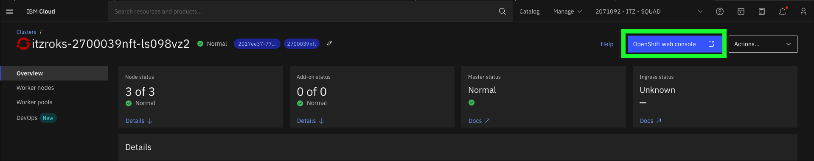
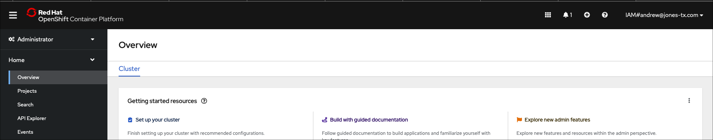
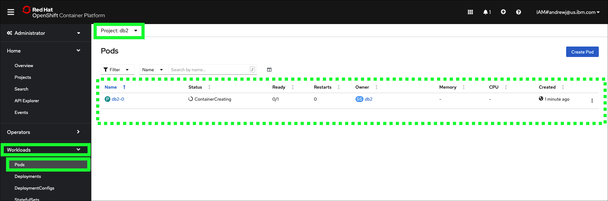

This demonstration requires two IBM Technology Zone (ITZ) environments:
- Custom ROKS requests: https://techzone.ibm.com/collection/custom-roks-vmware-requests
- IBM Cloud VSI (Classic): https://techzone.ibm.com/collection/base-images

At this point, all users should have completed the steps in the {{learningplan.name}} learning plan to reserve the two environments as described in the {{learningplan.name}} <a href="" target="_blank">Introduction video</a>. Before proceeding, validate that both the reservations have been fully provisioned and are in the **Ready** state in ITZ. If not, please complete those steps before proceeding.


The following steps must be performed before delivering the demonstration. These steps should be performed well in advance of starting an actual client demonstration as it will take approximately 1 hour for all steps to complete.

## Accept invitation to join the ITZ IBM Cloud account for the Custom ROKS reservation

1. Open the **You are invited to join an account in IBM Cloud** email received from IBM Cloud and click the **Join now** link.


2. In the browser window that opens, click the **Join Account** button.


Follow the steps to login to IBM Cloud.

3. On the **IBM Cloud Dashboard** set the current account to **{{tz_environment.cloudAccount}}**.


??? failure "Not seeing {{tz_environment.cloudAccount}}?"
    It is possible ITZ provisioned the OpenShift cluster in a different IBM Cloud account. Select the account specified in the ITZ reservation.
    

4. Click the **OpenShift**  icon in the left-hand menu bar.


5. Click **Clusters**.


6. Click the OpenShift cluster name in the table.


Note: the cluster name will be different than seen in the above image.

7. Click the **OpenShift web console** button.



At this time, a page like the one below should be in a new browser window or tab.



Leave this window open. It will be used again later.

## Download the SSH key from the IBM Cloud VSI (Classic) reservations

9. Open a **new** browser window or tab to the ITZ <href "https://techzone.ibm.com/my/reservations" target="_blank">**My reservations**</a> page.

10. Click on the **IBM Cloud VSI (Classic)** reservation tile.


11. Click the **Download SSH Key** button.


!!! important "Take note"
    Take note of the **Public IP**, **SSH Port**, and **Username** fields in the reservation. These values will be needed later.

By default, most browsers will utilize the default **Downloads** directory in the users home directory.

## Connect to the Virtual Server Instance (VSI)

The next step must be performed on the users local computer. The directions below are specific to users with a Mac computer (MacOS). All instructions listed here should be the same for users running on Linux machines.

!!! Note "For Windows machines users."
    Windows users will need to utilize a ssh client such as putty. XXXXXXX

12. Open a **terminal** on local desktop computer using Mac Spotlight (press the command key and the space bar).


13. Enter the following command to change to the Downloads directory where the ITZ private key was downloaded.

```
cd Downloads
```

14. Verify the **SSH key** file is found in the **Downloads** directory.

```
ls -l {{tz_environment.sshKeyFile}}
```

??? example "Example output"
    -rw-r--r--@ 1 andrewjones  staff  3243 Oct 18 13:12 {{tz_environment.sshKeyFile}}

??? failure "No such file or directory?"
    If the file was not found, verify the default download directory of the browser used in step 11 above and try again adjusting for correct download directory. It is also possible the SSH key file name was not saved as {{tz_environment.sshKeyFile}}. Check the Downloads directory for the most recent file names.

15. Change the permissions of the **SSH key** file.

```
chmod 0600 {{tz_environment.sshKeyFile}}
```

16. Verify the **SSH key** file has the proper permissions.

```
ls -l {{tz_environment.sshKeyFile}}
```

??? example "Example output"
    -rw-------@ 1 andrewjones  staff  3243 Oct 18 13:12 {{tz_environment.sshKeyFile}}

17. Use **ssh** to connect to the remote VSI and enter **yes** when prompted to continue.

!!! Warning
    Substitute the strings PORT, USER, and PUBLICIP with the values in the VSI reservation as illustrated in the image in step 11 above.

```ssh  -i {{tz_environment.sshKeyFile}} -p SSHPORT USERNAME@PUBLICIP```

??? example "Example output"
    MacBook-Pro-2:Downloads andrewjones$ ssh -i {{tz_environment.sshKeyFile}} -p 2223 itzuser@169.59.6.211

    The authenticity of host '[169.59.6.211]:2223 ([169.59.6.211]:2223)' can't be established.

    ED25519 key fingerprint is SHA256:YAN8U3PtpCzdhqc67F8ZQWlJjQgBV0DOi7LvZgDEtws.

    This key is not known by any other names

    Are you sure you want to continue connecting (yes/no/[fingerprint])? yes

    Warning: Permanently added '[169.59.6.211]:2223' (ED25519) to the list of known hosts.

    Welcome to Ubuntu 20.04.4 LTS (GNU/Linux 5.4.0-124-generic x86_64)

        ...
        **Long output - truncated in this example**
        ...


    To run a command as administrator (user "root"), use "sudo <command>".
    See "man sudo_root" for details.

## Install all required IBM Cloud and other tools

18. Use the following command to install all required tools.

```
bash <(curl -sL https://ibm.biz/ocp-cli)
```

!!! example "Example output"
    Updating the operating system. Wait!

    Installing Docker. Wait!

    Adding user to docker group. Wait!

    Setting up docker to start at reboot. Wait!

    Installing common utilities. Wait!

    Installing ibmcloud utility. Wait!

    Installing Helm. Wait!

    Installing OpenShift oc utility. Wait!

    Installing Kubernetes kubectl. Wait!

    cleaning up. Wait!

    All done.

    Client Version: 4.10.0

    version.BuildInfo{Version:"v3.10.1", GitCommit:"9f88ccb6aee40b9a0535fcc7efea6055e1ef72c9",
    GitTreeState:"clean", GoVersion:"go1.18.7"}

    Flag --short has been deprecated, and will be removed in the future. The --short output will

    become the default.

    Client Version: v1.25.3

    Kustomize Version: v4.5.7

    ibmcloud version 2.11.1+c18277d-2022-09-23T21:49:24+00:00

    Reboot your instance now: sudo shutdown -r now

!!! warning "If the reboot message is not seen"
    If the reboot message is not seen in the output of the previous command a problem occurred. Re-run the last command.  When doing so, ignore error messages about items already installed.

19. Restart the VSI.

```
sudo shutdown -r now
```

??? example "Example output"
    Connection to _PUBLICIP_ closed by remote host.
    Connection to _PUBLICIP_ closed.

Note, it will take a few minutes for the VSI to reboot. Wait 2 or 3 minutes and then continue the steps below.

## Download the B2Bi installation scripts

20. Use **ssh** to re-connect to the remote VSI.

!!! Warning
    Substitute the strings PORT, USER, and PUBLICIP with the values in the VSI reservation as illustrated in the image in step 11 above.

```ssh  -i pem-ibmcloudvsi-download.pem -p SSHPORT USERNAME@PUBLICIP```

??? example "Example output"
    MacBook-Pro-2:Downloads andrewjones$ ssh -i {{tz_environment.sshKeyFile}} -p 2223 itzuser@169.59.6.211
    Welcome to Ubuntu 20.04.5 LTS (GNU/Linux 5.4.0-124-generic x86_64)

    * Documentation:  https://help.ubuntu.com
    * Management:     https://landscape.canonical.com
    * Support:        https://ubuntu.com/advantage

    System information as of Tue Oct 18 19:58:23 UTC 2022

    System load:  0.65              Users logged in:          0
    Usage of /:   3.0% of 97.26GB   IPv4 address for docker0: 172.17.0.1
    Memory usage: 7%                IPv4 address for eth0:    10.36.166.233
    Swap usage:   0%                IPv4 address for eth1:    169.59.6.211
    Processes:    123


    8 updates can be applied immediately.
    8 of these updates are standard security updates.
    To see these additional updates run: apt list --upgradable

    New release '22.04.1 LTS' available.
    Run 'do-release-upgrade' to upgrade to it.

    Last login: Tue Oct 18 19:47:57 2022 from 70.114.143.247


21. Create a new directory B2Bi installation scripts.

```
mkdir b2bi
```

22. Set the **PROJECT_DIR** environment variable.

```
export PROJECT_DIR=$HOME/b2bi
```

23. Change directories to **PROJECT_DIR**.

```
cd $PROJECT_DIR
```

24. Download the B2Bi installation script.

```
wget -O {{b2bi.installScript}} {{gitRepo}}/{{b2bi.installPath}}/{{b2bi.installScript}}?raw=true
```
<!-- wget -O rapid-lab-b2bi-newlab-61051.zip  https://github.com/IBM/PEMStandard-BDAwithB2Bi/blob/main/tools/rapid-lab-b2bi-newdb-61051.zip?raw=true -->

??? example "Example output"
    --2022-10-18 20:12:56--  https://github.com/IBM/SalesEnablement-SterlingDataExchange-L3/blob/main/tools/rapid-lab-b2bi-newdb-61051.zip?raw=true

    Resolving github.com (github.com)... 140.82.113.4

    Connecting to github.com (github.com)|140.82.113.4|:443... connected.

    HTTP request sent, awaiting response... 302 Found

    Location: https://github.com/IBM/SalesEnablement-SterlingDataExchange-L3/raw/main/tools/rapid-lab-b2bi-newdb-61051.zip [following]

    --2022-10-18 20:12:56--  https://github.com/IBM/SalesEnablement-SterlingDataExchange-L3/raw/main/tools/rapid-lab-b2bi-newdb-61051.zip

    Reusing existing connection to github.com:443.

    HTTP request sent, awaiting response... 302 Found

    Location: https://raw.githubusercontent.com/IBM/SalesEnablement-SterlingDataExchange-L3/main/tools/rapid-lab-b2bi-newdb-61051.zip [following]

    --2022-10-18 20:12:57--  https://raw.githubusercontent.com/IBM/SalesEnablement-SterlingDataExchange-L3/main/tools/rapid-lab-b2bi-newdb-61051.zip

    Resolving raw.githubusercontent.com (raw.githubusercontent.com)... 185.199.110.133, 185.199.111.133, 185.199.108.133, ...

    Connecting to raw.githubusercontent.com (raw.githubusercontent.com)|185.199.110.133|:443... connected.

    HTTP request sent, awaiting response... 200 OK

    Length: 4061226 (3.9M) [application/zip]

    Saving to: ‘rapid-lab-b2bi-newlab-61051.zip’

    rapid-lab-b2bi-newlab-61051.zip                             100%[=========================================================================================================================================>]   3.87M  --.-KB/s    in 0.03s

    2022-10-18 20:12:57 (147 MB/s) - ‘rapid-lab-b2bi-newlab-61051.zip’ saved [4061226/4061226]

25. Unzip the installation script.

```
unzip {{b2bi.installScript}}
```

??? example "Example output"
    Archive:  {{b2bi.installScript}}

      inflating: deploy_mq.sh

      inflating: edited-values.yaml

      inflating: prepare_db2.sh

      inflating: deploy_db2.sh

      inflating: README.md

      inflating: COPYING

      inflating: env.sh

      inflating: deploy_b2bi.sh

      inflating: db2jcc4.jar

## Authenticate to the OpenShift cluster

For the next steps, the **OpenShift** login command to authenticate to the cluster in the ITZ reservation must be retrieved an executed.

26. Switch to the **OpenShift web console** browser window or tab.


27. Click the **IAM** identity drop-down menu at top left of the **OpenShift web console** and click the **Copy Login Command** option.


28. Click the **Display token** link.


29. Copy and paste the string in the **Log in with this token** field.


30. Switch to the **SSH** terminal window from earlier.
31. Paste the **oc login** command line copied in step 29 into the terminal window and press enter.

!!! example "Example output"
    itzuser@itz-2700039nft-srv4:~/b2bi$ oc login --token=sha256~XXXXXXXXXXXXXXXXXX --server=https://c103-e.us-south.containers.cloud.ibm.com:31501

    Logged into "https://c103-e.us-south.containers.cloud.ibm.com:31501" as "IAM#andrew@jones-tx.com" using the token provided.

    You have access to 66 projects, the list has been suppressed. You can list all projects with 'oc projects'

    Using project "default".

    Welcome! See 'oc help' to get started.

    itzuser@itz-2700039nft-srv4:~/b2bi$

32. Run the environment setup and Db2 deploy scripts.

```
. env.sh ; ./deploy_db2.sh
```

??? example "Example output"
    Now using project "db2" on server "https://c109-e.us-east.containers.cloud.ibm.com:30720".

    You can add applications to this project with the 'new-app' command. For example, try:

    oc new-app rails-postgresql-example

    to build a new example application in Ruby. Or use kubectl to deploy a simple Kubernetes application:

    kubectl create deployment hello-node --image=k8s.gcr.io/e2e-test-images/agnhost:2.33 -- /agnhost serve-hostname

    serviceaccount/db2 created
    clusterrole.rbac.authorization.k8s.io/system:openshift:scc:privileged added: "db2"
    secret/db2-secret created
    service/db2-ci created
    service/db2-lb created
    statefulset.apps/db2 created

!!! warning "Wait 5 minutes..."
    Wait approximately 5 minutes for the Db2 containers to start loading in OpenShift before executing the next step.

??? tip "Monitor events in OpenShift web console"
    Use the OpenShift web console to monitor the **Db2** project events and pod creation.
    
    


33. Verify Db2 is up and running in the OpenShift cluster.

```
oc logs -f ${DB2_NAME}-0
```

!!! failure
    If no output is seen from the above command, or if it returns the message: _Error from server (BadRequest): container "db2" in pod "db2-0" is waiting to start: ContainerCreating_  wait and rerun oc logs -f ${DB2_NAME}-0 until the output starts steaming as shown in the example output below.

!!! example "Example output"
    (\*) Previous setup has not been detected. Creating the users...

    (\*) Creating users ...

    (\*) Creating instance ...

    DB2 installation is being initialized.

    Total number of tasks to be performed: 4
    Total estimated time for all tasks to be performed: 309 second(s)

    Task #1 start
    Description: Setting default global profile registry variables
    Task #1 end

    Task #2 start
    Description: Initializing instance list
    Estimated time 5 second(s)
    Task #2 end

    Task #3 start
    Description: Configuring DB2 instances
    Estimated time 300 second(s)
    Task #3 end

    Task #4 start
    Description: Updating global profile registry
    Estimated time 3 second(s)
    Task #4 end


        ...
        **Long output - truncated in this example**
        ...


    2022-10-18-16.44.43.180954+000 I33681E386            LEVEL: Warning
    PID     : 15858                TID : 139996146354048 PROC : db2start

    INSTANCE: db2inst1             NODE : 000

    HOSTNAME: db2-0

    FUNCTION: DB2 UDB, base sys utilities, sqleReleaseStStLockFile, probe:16078

    MESSAGE : Released lock on the file:

    DATA #1 : String, 50 bytes

    **/database/config/db2inst1/sqllib/ctrl/db2strst.lck**

!!! warning "Do not proceed until..."
    Do not proceed to the next step until the following line appears in the output:

    **/database/config/db2inst1/sqllib/ctrl/db2strst.lck**

34. Stop the **oc logs** command by entering ++ctrl++**+c** on the keyboard.

!!! example "Example output"
    ...
    FUNCTION: DB2 UDB, base sys utilities, sqleReleaseStStLockFile, probe:16078

    MESSAGE : Released lock on the file:

    DATA #1 : String, 50 bytes

    **/database/config/db2inst1/sqllib/ctrl/db2strst.lck**

    ^C

    itzuser@itz-2700039nft-srv4:~/b2bi$

35. Prepare the Db2 instance running in OpenShift.

```
./prepare_db2.sh
```

Note, this script does not generate output.

36. Remotely connect to the Db2 container running in OpenShift.

```
oc rsh pod/${DB2_NAME}-0 su - db2inst1
```

!!! example "Example output"
    Last login: Tue Oct 18 20:47:33 UTC 2022

    [db2inst1@db2-0 ~]$

Note, a remote connection is now open to the Db2 container running in OpenShift as shown by the change in the command prompt to: **[db2inst1@db2-0 ~]$**

37. Run the **db2reg.sh** script.

```
./db2reg.sh
```

??? example "Example output"
    DB20000I  The UPDATE DATABASE MANAGER CONFIGURATION command completed
    successfully.

    DB20000I  The UPDATE DATABASE MANAGER CONFIGURATION command completed
    successfully.

    DB20000I  The UPDATE DATABASE MANAGER CONFIGURATION command completed
    successfully.

    DB20000I  The UPDATE DATABASE MANAGER CONFIGURATION command completed
    successfully.

    DB20000I  The UPDATE DATABASE MANAGER CONFIGURATION command completed
    successfully.

    DB20000I  The UPDATE DATABASE MANAGER CONFIGURATION command completed
    successfully.

    DB20000I  The UPDATE DATABASE MANAGER CONFIGURATION command completed
    successfully.

    DB20000I  The UPDATE DATABASE MANAGER CONFIGURATION command completed
    successfully.

38. Create the B2Bi tables in Db2.

```
db2 -stvf create_scc_db_b2bidb.sql
```

!!! warning "This will take ~5 minutes"
    This command will take approximately 5 minutes to complete.

??? example "Example output"
    CREATE DATABASE B2BIDB AUTOMATIC STORAGE YES USING CODESET UTF-8 TERRITORY US COLLATE USING IDENTITY PAGESIZE 4096 DFT_EXTENT_SZ 32

    DB20000I  The CREATE DATABASE command completed successfully.

    CONNECT TO B2BIDB

       Database Connection Information

     Database server        = DB2/LINUXX8664 11.5.5.1
     SQL authorization ID   = DB2INST1
     Local database alias   = B2BIDB

    UPDATE DATABASE CONFIG USING STMT_CONC LITERALS

    DB20000I  The UPDATE DATABASE CONFIGURATION command completed successfully.

    ...
    **Long output - truncated in this example**
    ...

    CREATE USER TEMPORARY TABLESPACE UTEMP4KTS IN DATABASE PARTITION GROUP IBMDEFAULTGROUP PAGESIZE 4 K MANAGED BY AUTOMATIC STORAGE EXTENTSIZE 32 BUFFERPOOL UTEMP4KBP FILE SYSTEM CACHING

    DB20000I  The SQL command completed successfully.

    CONNECT RESET

    DB20000I  The SQL command completed successfully.

39. Run the final Db2 update script.

```
./db2-update.sh
```

??? example "Example output"
    Database Connection Information

    Database server        = DB2/LINUXX8664 11.5.5.1
    SQL authorization ID   = DB2INST1
    Local database alias   = B2BIDB

    DB20000I  The SQL command completed successfully.
    DB20000I  The TERMINATE command completed successfully.
    DB20000I  The FORCE APPLICATION command completed successfully.
    DB21024I  This command is asynchronous and may not be effective immediately.

    DB20000I  The DEACTIVATE DATABASE command completed successfully.

    10/18/2022 16:53:39     0   0   SQL1064N  DB2STOP processing was successful.

    SQL1064N  DB2STOP processing was successful.

    10/18/2022 16:53:41     0   0   SQL1063N  DB2START processing was successful.

    SQL1063N  DB2START processing was successful.

40. Exit the connection to the Db2 container in OpenShift.

```
exit
```

??? example "Example output"
    logout
    itzuser@itz-2700039nft-srv4:~/b2bi$

Notice the command line prompt has changed back to the prompt for the VSI connection.

41. Deploy MQ to OpenShift.

```
./deploy_mq.sh
```

??? example "Example output"
    Now using project "mq" on server "https://c109-e.us-east.containers.cloud.ibm.com:30720".

    You can add applications to this project with the 'new-app' command. For example, try:

       oc new-app rails-postgresql-example

    to build a new example application in Ruby. Or use kubectl to deploy a simple Kubernetes application:

      kubectl create deployment hello-node --image=k8s.gcr.io/e2e-test-images/agnhost:2.33 -- /agnhost serve-hostname

    serviceaccount/mq created
    clusterrole.rbac.authorization.k8s.io/system:openshift:scc:privileged added: "mq"
    service/mq-data created
    service/mq-web created

    W1018 16:54:39.757566   34060 shim_kubectl.go:58] Using non-groupfied API resources is deprecated and will be removed in a future release, update apiVersion to "route.openshift.io/v1" for your resource

    route.route.openshift.io/mq-web created

    secret/mq-secret created

    statefulset.apps/mq created

!!! important
    Note, the next steps require editing of a file using the **vi** editor on the VSI. If you are not familiar with the **vi** editor, it is strongly recommend to watch the following video before proceeding. There is no audio for this video.

    

42. Open the **vi** editor.

```
vi  env.sh
```

43. Open the IBM **Entitlement key** page <a href="https://myibm.ibm.com/products-services/containerlibrary" target="_blank">here</a>.

Note, re-authentication to ibm.com may be required.

44. If an entitlement key does not already exist, click **Add new key**.
45. Click the **Copy** button.


46. Return to the **terminal** and paste the copied **entitlement key** between the quotes on the **export APIKEY=""** line.
47. Enter your e-mail address between the quotes on the **export EMAIL=""** line.
48. Verify the env.sh file looks like the example output below.

```
cat env.sh
```

!!! example "Example output"
    itzuser@itz-2700039nft-srv4:~/b2bi$ cat env.sh
    \#!/usr/bin/bash
    \#\# Locate your APIKEY (Entitlement Key For Container Software)
    \#\# here: https://myibm.ibm.com/products-services/containerlibrary
    \#\# Requires IBM ID and permission.
    export PROJECT_NAME="b2bi"
    export PROJECT_DIR="$HOME/b2bi"
    export DB2_NAME="db2"
    export MQ_NAME="mq"
    export APIKEY="XXXXXXXXXXXXXXXXXXXXXXXXXXXXXXXXXXXXXXXXXXXXXXXXXXXXXX"
    export EMAIL="andrew@jones-tx.com"
    itzuser@itz-2700039nft-srv4:~/b2bi$

49. Deploy the B2Bi containers on OpenShift.

```
./deploy_b2bi.sh
```

!!! warning "This will take approximately 60 minutes"
    This command will take approximately 60 minutes to complete.

??? tip "Monitor events in OpenShift web console"
    Use the OpenShift web console to monitor the **b2bi** project events and pod creation.
    

    

??? example "Example output"
    Now using project "b2bi" on server "https://c103-e.us-south.containers.cloud.ibm.com:31501".

    You can add applications to this project with the 'new-app' command. For example, try:

      oc new-app rails-postgresql-example

    to build a new example application in Ruby. Or use kubectl to deploy a simple Kubernetes application:

      kubectl create deployment hello-node --image=k8s.gcr.io/e2e-test-images/agnhost:2.33 -- /agnhost serve-hostname

    persistentvolumeclaim/ibm-cloud-file-nfs-storage-pvc created
    clusterrole.rbac.authorization.k8s.io/system:openshift:scc:anyuid added: "default"
    deployment.apps/ibm-cloud-file-nfs-storage-pod created
    Defaulted container "ibm-cloud-file-nfs-storage-pod" out of: ibm-cloud-file-nfs-storage-pod, permissionsfix (init)

    ...
    **Long output - truncated in this example**
    ...

    NAME: sterling-fg

    LAST DEPLOYED: Wed Oct 19 17:11:30 2022

    NAMESPACE: b2bi

    STATUS: deployed

    REVISION: 1

    NOTES:

    Please wait while the application is getting deployed.

    1. Run the below command to check the status of application server replica sets. At least 1 replica must be in 'READY' state.

         kubectl get replicasets -l release=sterling-fg -n b2bi

    2. Run the below command to check the status of the application server pods for the release.

        kubectl get pods -l release=sterling-fg -n b2bi -o wide

    To view the logs for a pod, run the below command.

        kubectl logs <pod name> -n b2bi

    3. Access the application by running the following url

That concludes the setup of the environment. Proceed to the next part of the demonstration guide to configure B2Bi.
