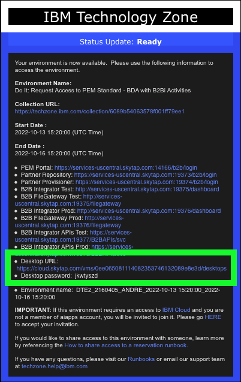
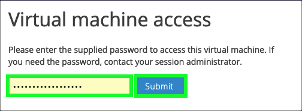
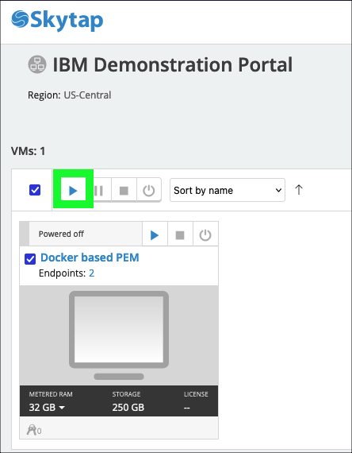
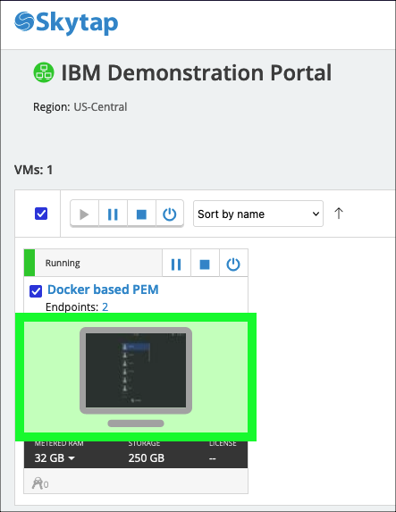
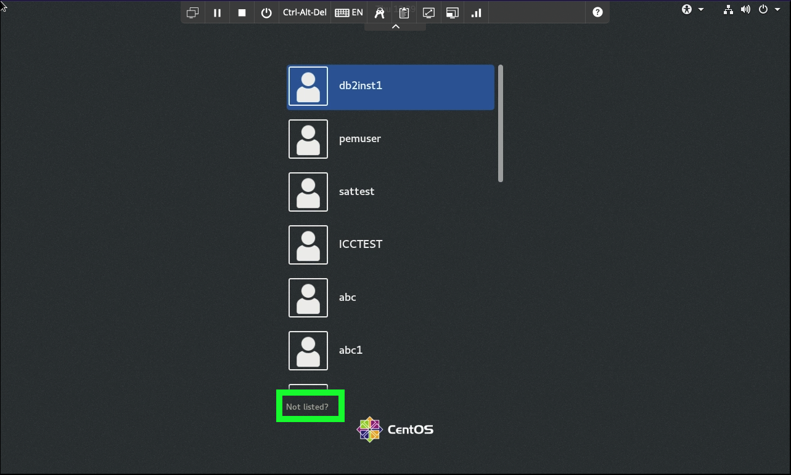
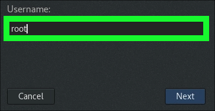
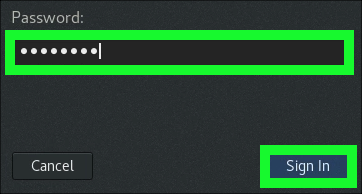
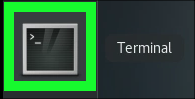

The following steps must be performed before delivering the demonstration. These steps should be performed several minutes prior to starting an actual client demonstration as the software services used take a few minutes to start and enter a ready state.

## Start the Virtual Machine (VM) in the reserved Skytap environment

1. Open a browser window/tab using the **Desktop URL** found in the IBM Technology Zone email with the subject line "Your environment is ready".



If prompted for a **Virtual machine access** password like in the image below, enter the **Desktop password** specified in the IBM Technology Zone email with the subject line "Your environment is ready" (highlighted in the above image) and click **Submit**.



2. Click the **play** button to start the demonstration virtual machine (VM).



Wait until the VM changes from **Busy** to **Running** before proceeding.

3. Click on the **computer screen icon** to open the VM.



## Login to the VM and start all required services

4. At the CentOS log in window, click **Not listed?**.



5. Enter **root** at the **Username:** prompt and then click **Next**.



6. Enter **passw0rd** at then click **Sign In**.

Note: the password contains a zero and not a capital O.



7. Click the **Activities** menu at top left.


8. Click the **Terminal** option in the **Activities** menu.



9. In the **Terminal** window, run the **svStartAll.sh** script.

```
svStartAll.sh
```

!!! example "Example output"
    XXXXXXX


!!! warning "Do not proceed until the all services are running!"
    It will take approximately 10 minutes for all the resources to start. To confirm all processes are running, issue the **svCheck.sh** command.
    ```
    svCheck.sh
    ```
    Do not proceed until the script reports that all processes are either **Running** or **up**. Continue executing the **svCheck.sh** command until the output is like that shown below:

    Example output:
    XXXXXXX

## Add a new **partner** for the demonstrations

That concludes the preparation steps required for the demonstration environment. In the next chapter, explore **Use Case #1: Onboarding a Partner using the Applicability Statement 2 (AS2) Protocol**.
