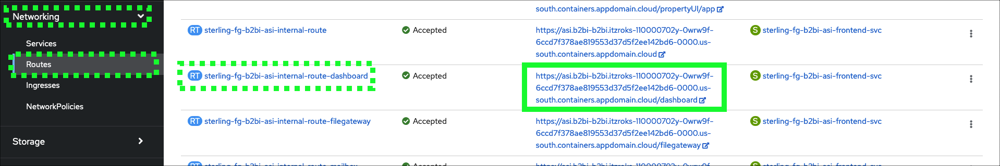
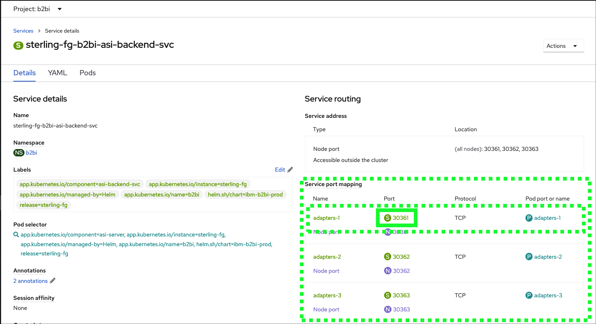
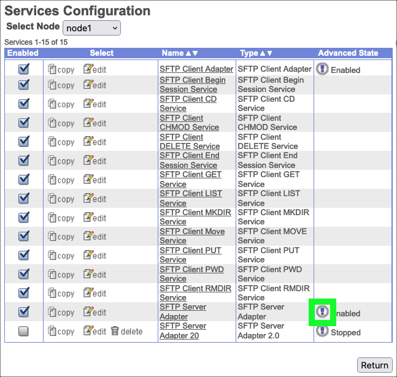

- On board test partners
- 3 methods for file transfer between 2 test partners
- route and service partners

Secure File Transfer Protocol (SFTP)

Notice all the routes that are currently defined in the b2bi Project, there are 15 of them

To start the setup of the test partner accounts, launch the B2Bi dashboard by clicking on the route for the sterling-fg-b2bi-asi-internal-route-dashboard route in the **Location** column. Do not click the Route name... click the Route link in the **Location** column of the table.

If a security risk is received in the brwoser, accept it. In a production environment certificates would be configured for these web pages.

Note: shown are for the Firefox browser.They will look different depending on browser.

As this is a new install, in this demonstration the default user ids and passwords will be used. To keep things simple in this demonstration, all passwords will be set to "password".  Not secure, but this will be a short lived demonstration environment.

Log in the the IBM Sterling B2B Integrator (B2Bi) dashboard using the id: admin and password password.

First, a **SSH Host Identity** needs to be created. The Host Identity Key is a Private/Public key pair used to identify the Application SFTP Server to remote clients.  Note, for this demonstration, default values will be used where possible, but production deployments may use other values depending on client requirements.

Click the **Deployment** menu item in left-hand menu bar.

Click the **SSH Host Identity Key** menu item in the left-hand menu bar.
B2BiMainMenuDeploymentToHIK.png

Click the **Go!** button in the **Create: New Host Identity Key** box.

Enter **demo** in the **Host Name:** field of the "New Host Identity Key" form and then click the **Next** button.

Click **Finish**.

Click **OK**

Wait until the completed message is received and the click the **Return** button.

Next, an SFTP adapter must be created which will utilize the OpenShift service port for B2Bi.

Click the **Services** menu item under **Deployment** in the left-hand menu bar.

Click the **Configuration** menu item under **Services**.

Enter **sftp** in the **Service Name** field and click the **Go!** button in the **Search** box.

Locate the **SFTP Server Adapter** entry in the table and click the **edit** button.

Review the default settings and click **Next**.

Review the settings on the **SFTP Server Adapter: Configuration** form.

The default **SFTP Server Listen Port** must be changed to the B2Bi service port configured in OpenShift.

Switch back to the OpenShift web console browser window or tab and click the **Services** under the **Networking** in the left-hand menu bar.

Find and click the **sterling-fg-b2bi-asi-backend-svc** link.

Locate and copy the **Service Port** number for **adapters-1** in the **Service port mapping** table.

Record this **Service Port** number, it will be used several times during this demonstration.

Switch back to the **B2Bi Dashboard** browser window or tab.

Enter or copy the recorded **Service Port** number into the **SFTP Server Listen Port** entry field and click **Next**.

Click **Next** on the **SFTP Server Adapter: Configuration: Document Storage** page.

Review the default settings on the **SFTP Server Adapter: Add Policies** page and click **Next**.

Review the default settings on the **SFTP Server Adapter: Configuration** page and click **Next**.

Review the default settings on the **SFTP Server Adapter: Extractability** page and click **Next**.

Review the **SFTP Server Adapter: Confirmation** page and click **Finish**.

Click **Return** after the new SFTP adapter has been created.

Click the **checkbox** next to the **SFTP Server Adapter** to start the adapter.

Click the  next to the **SFTP Server Adapter**.

Verify the **SFTP Server Adapter** is **Running**.

Close the **Adapter Information** pop-up window.

Click the **Logout** link to log out of the **B2Bi dashboard**.

