Create Partner community

Return to the OpenShift web console and click on the route link to the IBM Sterling File Gateway user interface (UI): **sterling-fg-b2bi-asi-internal-route-filegateway portal


At the IBM Sterling File Gateway

Enter **fg_sysadmin** in the User ID field, **password** in the Password field, and then click the **Sign In** button.

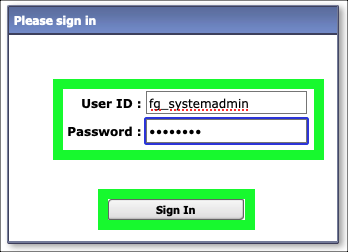

Click the **Participants** pull-down menu item on top menu bar.

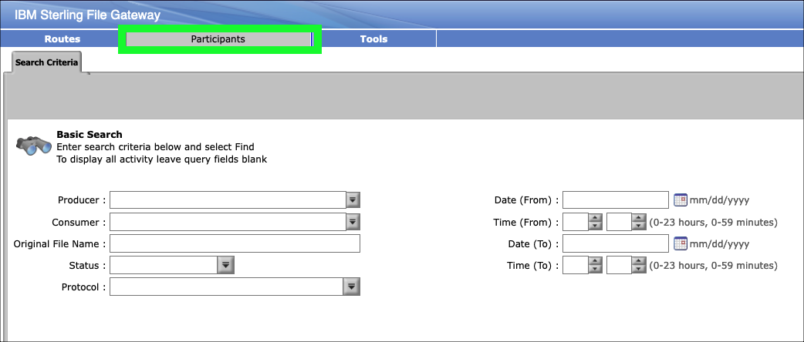

Click **Communities** in the **Participants** menu.


In the **Communities** pop-up window, click the **add** link.


Enter **sftp_community** in the **Community Name** entry field and click **Next**.

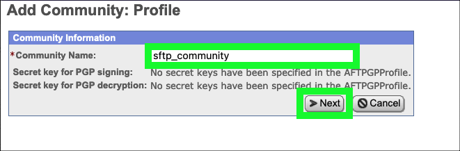

Select both the **Partner Initiates Protocol Connections to Mailbox** and the **Partner Listens for Protocol Connections** check boxes.

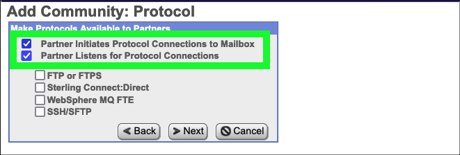

Select the **SSH/SFTP** checkbox and click **Next**.

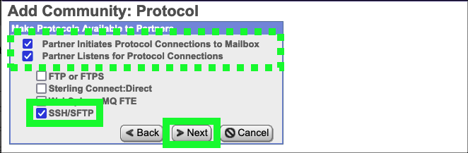

Click **Next** on the **Add Community: Notifications** form.

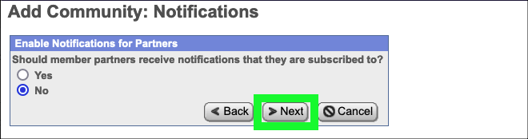

Click **Finish** to confirm the creation of the new community.

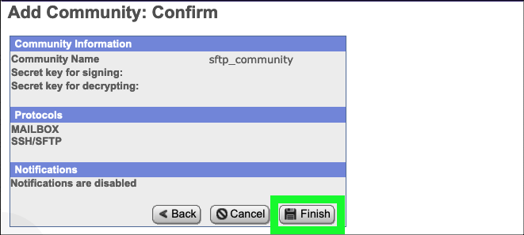

Click **Return** on the community confirmation screen.


Next, add 2 partners to the newly created **sftp_community**.

Click the **edit** link for the **sftp_community** on the **Communities** listing pop-up window.

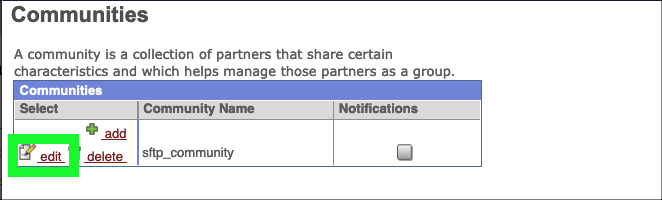

Under **Partner**, click the **Add** link.

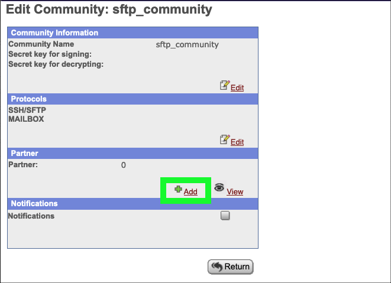

Enter **partner1** in the **Partner Name** field, 10 digits in the **Phone** field and **partner1@localhost.com** in the **Email Address** field, and then click **Next**.

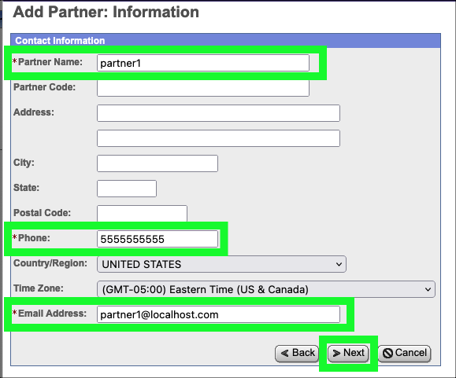

Enter **partner1** in the **User Name** field, **password** in the **Password** field, **password** in the **Confirm Passwod** field, **Partner** in the **Given Name** field, and **Surname** field, and then click **Next**.

F

Click **partner1 is a Producer of Data** and then click **Next**.

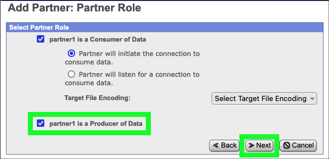

Review the default settings on the **Initiate Connections Settings** screen and then click **Next**.

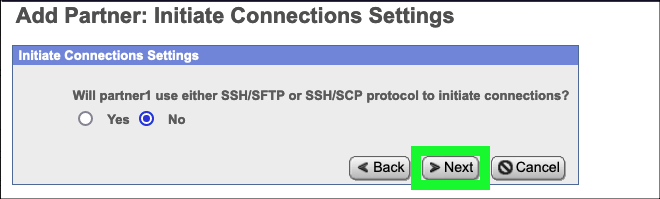

Review the default settings on the **PGP Settings** screen and then click **Next**.


Review the settings for **partner1** and click **Finish**.


Click **Return** on the **Added Partner Successful** screen.


Repeat the last 8 steps to create a second partner named **partner2** using the same settings.

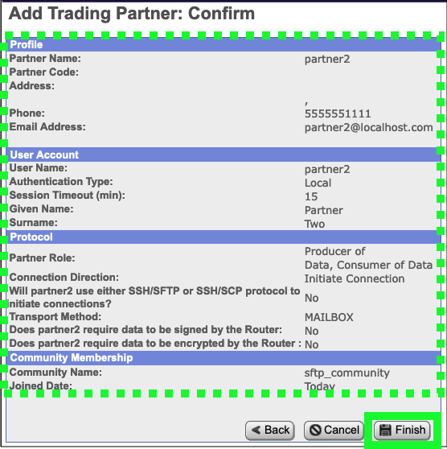

Click **Return** on the **Edit Community: sftp_community** screen after creating both partners.

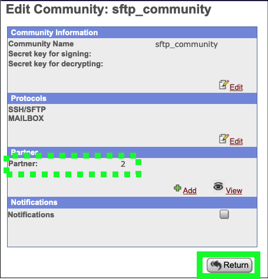

Close the **Communities** pop-up window.

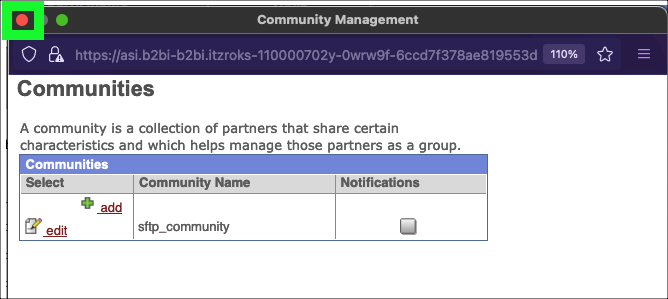

Click **Partners** under the **Participants** menu.


Click the **Refresh** button if **partner1** and **partner2** do not appear in the **Partners** table.

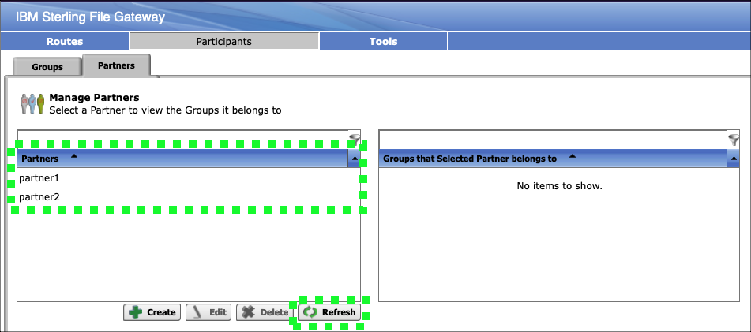

## Create routing template

Click **Templates** under the **Routes** menu.


Click the **Create** button at the bottom of the **Routing Channel Templates** page.

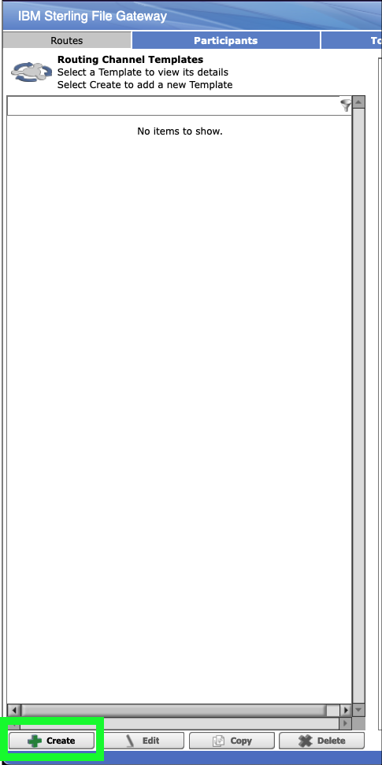

Enter **Passthrough** in the **Template Name** field and then click **Next>>**.

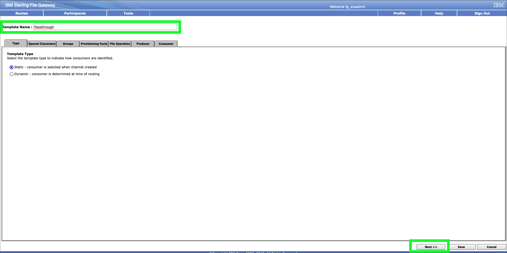

Review the **Special Characters** settings and then click **Next>>**.

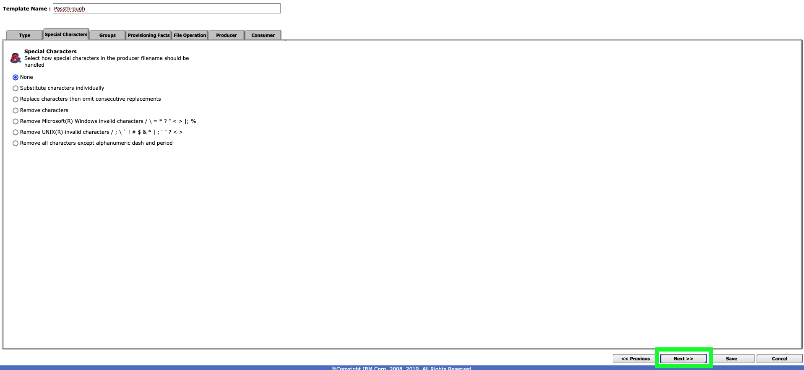

Add **All Partners** to both the **Producer Groups** and **Consumer Groups** tables.


Click **Next>>** after adding **All Partners** to both groups.


Review the **Provisioning Facts** page and then click **Next>>**.


Review the **File Operation** page and then click **Next>>**.

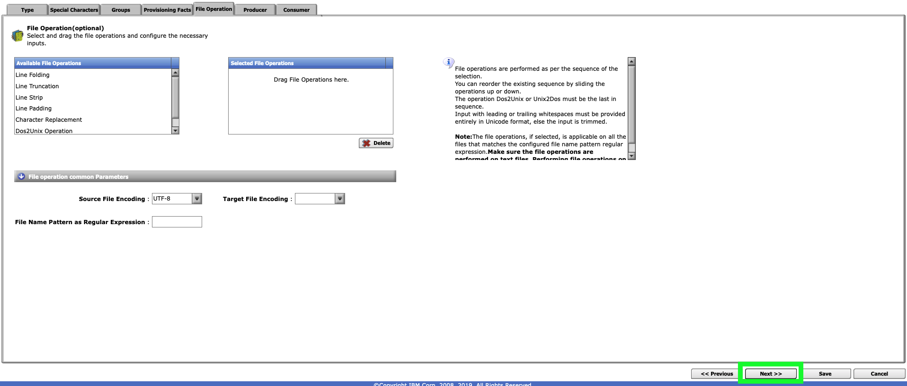

Click the **Add** button on the **Producer** page.


Click the **Producer File Type** pull-down menu and select **Unknown**.

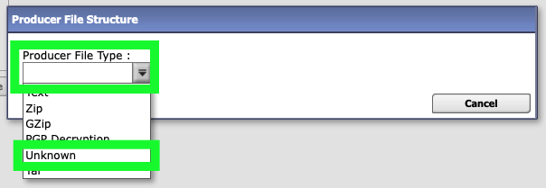

Enter **.+** in the **File name pattern as regular expression** field and then click **Save**.


Setting the file pattern to the regular express **.+** allows for file names of one or more characters.

Click **Next>>** on the **Producer**  page.

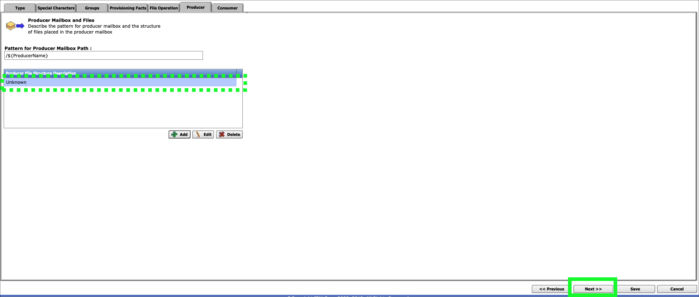

Click the **Add** button on the **Consumer** page.

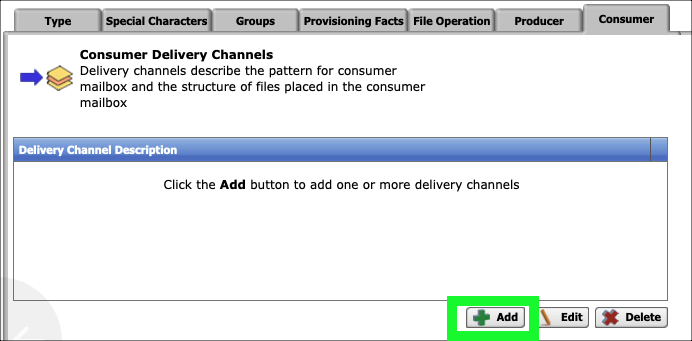

Click the **Add** button on the **New Delivery Channel** pop-up window.

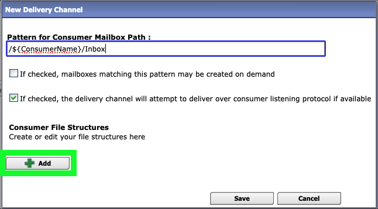

Click **Unknown** in the **Consumer File Type** pull-down menu.

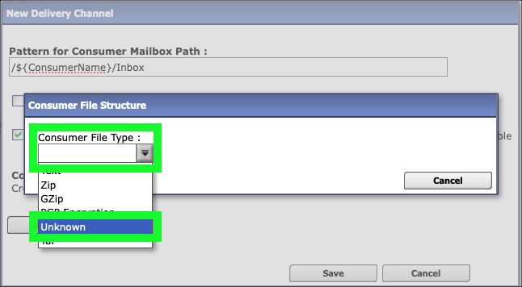

Enter **${ProducerFileName}** in the **File name format*** field.

```
${ProducerFileName}
```

Review the help information regarding file name formats by overing over the **File name format** entry field and then click **Save**.


Click **Save** on the **New Delivery Channel** pop-up window.

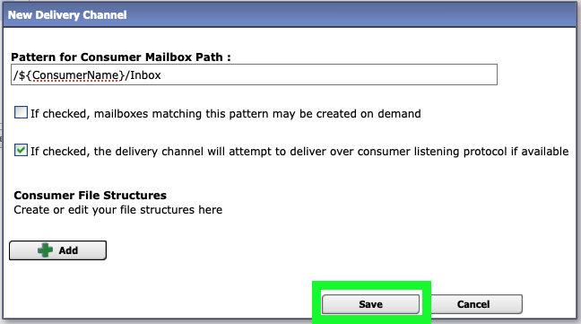

Click **Save** on the **Consumer** page.

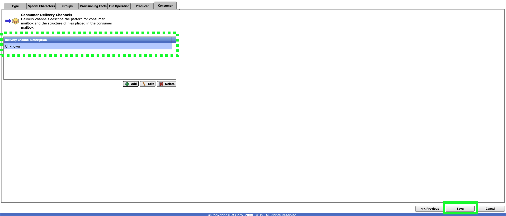

Click **OK** on the **Routing Channel Template successfully created.** pop-up message.


Review the settings for the new **Passthrough** routing channel template.

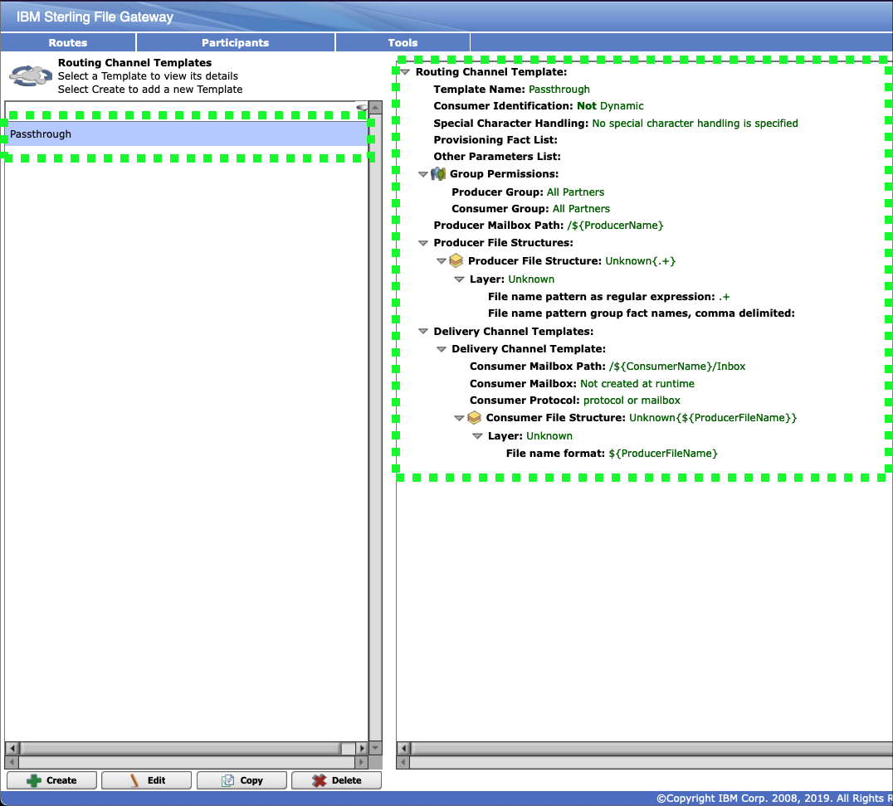

Click the **Channels** option under the **Routes** menu.

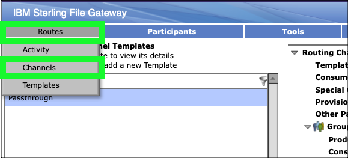

Click the **Create** button at bottom right to create a new **Channel**.


Select **Passthrough** for the **Routing Channel Template**, **partner1** for the **Producer**, and **partner2**  for the **Consumer**, and then click **Save** to create the new channel.

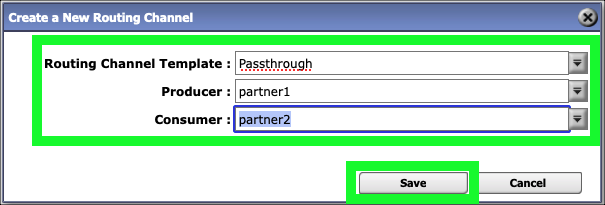

Click **OK** on the **Success** pop-up window.

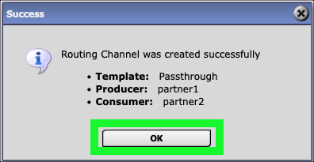

Repeat the last 3 steps to create a channel from partner2 to partner 1.

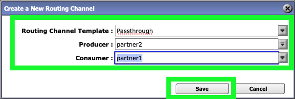

Click **Sign Out**.

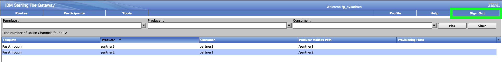

In the next chapter, the fun begins as the partners start to securely exchange files.
