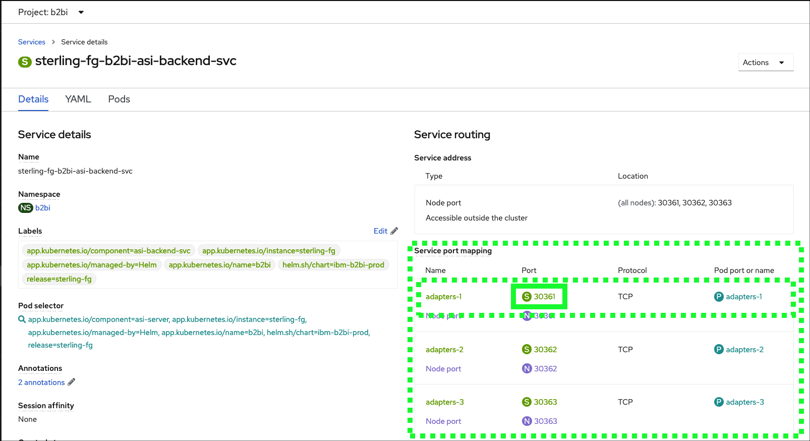

It is now time to transfer files, but first one last setup step to make the demonstration more visually exciting.

In this demonstration, the FileZilla application will be used.  FileZilla is a free and open-source, cross-platform FTP application, consisting of FileZilla Client and FileZilla Server. Clients are available for Windows, Linux, and macOS. Both server and client support FTP and FTPS, while the client can in addition connect to SFTP servers. You can learn more about FileZilla <a href="https://filezilla-project.org/" target="_blank">here</a>.

If users do not already have FileZilla installed, do so now. IBM employees can download FileZilla from the Mac@IBM store.  For Business Partners and IBMers on Microsoft Windows, the download links are available at the link above.

If users are unable to use FileZilla, it is recommended to use the IBM Sterling File Gateway clients for both users in the scenario that follows.  To avoid having to log in and out between user actions, it is recommended to use two different browsers (e.g. Chrome and Firefox) for each user or private/incognito windows for each user when accessing the IBM Sterling File Gateways.

When doing a client demonstration, it is recommended to split the FileZilla and browser windows on the same screen to avoid switching back and forth during the demonstration.

For this scenario, **partner1** will use the IBM Sterling File Gateway clients, and **partner2** will use FileZilla.

## Configure FileZilla for partner2

To configure FileZilla for **partner2** both the File Gateway route address and port numbers will be needed.

Return to the OpenShift web console and click on the **sterling-fg-b2bi-asi-internal-route** route on the **Routes** page.

OS_InternalRoute1.png

Select the **Host** field, right click, and click **Copy**.

Note, the example below was captured using Firefox on MacOS. Others browser menus options may be labeled differently.

OS_InternalRoute2.png

Open the FileZilla application on local computer.

FileZilla.png

Click the **FileZilla Site Manager**  icon.

FileZillaSiteManager.png

Click the **New site** button.

FZ_NewSiteButton.png

Enter **B2BGateway** for the **New Site** name and press enter.

FZ_NewSiteName.png

Select **SFTP - Secure File Transfer Protocol** on the **Protocol** pull-down menu.

FZ_NewSiteProtocol.png

Paste the **route** copied in step XXXXXX into the **Host** field.

FZ_NewSitePasteHost.png

Enter the **port number** of the **sterling-fg-b2bi-asi-backend-svc** service in the **Port** field.

FZ_NewSitePort

??? tip "Don't remember the port number?"
    The port number can be found in the details of the **sterling-fg-b2bi-asi-backend-svc** service in the OpenShift web console.

    

Enter **partner2** in the **User** field and **password** in the **Password** field and click the **Connect** button.

FZ_NewSiteUserPassword.png

Check the **Always trust this host, add this key to cache** checkbox, and click **OK** on the **Unknown host key** pop-up window.

FZ_UKnknownHostKey.png

Notice the connection is established and the **Remote site** shows no files.

FZ_Connected.png

At this time, it is recommended to have both FileZilla and the OpenShift web console both visible at the same time (either split on a single screen or using multiple monitors).

OS_FZ_splitScreen.png

Next, create or download 2 sample files that will be transferred between partner1 and partner2. Since the templates created earlier allow for any file names to be transferred it does not matter what files are used.  It is suggested to use small files so the transfers happen quickly.  Feel free to download these two sample invoice files to use. Just right click the links and save to the local Downloads directory --XXxXxxxxx update these directions with URLs.

XXxXxxxxxXXXX

## Transfer a file from partner1 to partner2 using the IBM Sterling My File Gateway 2.0

In the OpenShift web console click the link to open the link to the **sterling-fg-b2bi-asi-internal-route-myfg** route.

OS_Route-MyFG.png

Enter **partner1** in the **User name** field, **password** in the **Password** field, and then click **Log in**.

MyFG_login.png

Click the hamburger menu icon  at top right and click **Uploads**.

MyFG_UploadsMenu.png

Click the **/** directory in left-hand panel.

MyFG_DirectorySelect.png

Click the **select** link in the **Upload to /** panel.

MyFG_UploadPanel.png

Click the **SampleInvoice1.xml** file in the **Downloads** directory and click **Open**.

!!! note "Note"
    Navigate to the directory where the sample invoice files were downloaded or pick another file to transfer.  Do not transfer any file with confidential or personal information. The image above was captured using Firefox on MacOS, other browsers and operating system combinations may look different.

MyFG_UploadFileDialog.png

Verify in the **myFileGateway** application that the file transferred successfully.

MyFG_UploadFileTransferSuccess.png

Verify in **FileZilla** that **partner2** received the file.

FZ_UploadFileTransferSuccess.png

!!! note "Note"
    The file size shown in **IBM Sterling My File Gateway 2.0** is in kilobytes (KB) and in **FileZilla** the file size is displayed in bytes, but they are the same and the file transfer was successful.

It is important to realize the file has been transferred to the **B2Bi Gateway** repository. In a production environment, **partner2** would need to download the file. FileZilla is showing the contents of the data store on the gateway that **partner2** has permissions to see.

## View the details of the file transfer in **IBM Sterling My File Gateway 2.0**

Click **File activity** under the hamburger menu icon 

MyFG_FileActivityMenu.png

Click the link for the recently uploaded file: **SampleInvoice1.xml**.

MyFG_FileActivity.png

Review the events that occurred during the file transfer.

MyFG_FileActivityDetails.png

Notice in events **FG_0503** and **FG_0504** show the **Passthrough** channel template was used to properly route the transferred file to **partner2**.

For additional demonstrations, consider the following:

- Transfer a file from **partner2** to **partner1**.
- Verify the file transfers using the **IBM Sterling File Gateway** application.
- Transfer a file using the older version of **IBM Sterling My File Gateway** using the **sterling-fg-b2bi-asi-internal-route-myfilegateway** route found in the OpenShift web console.
