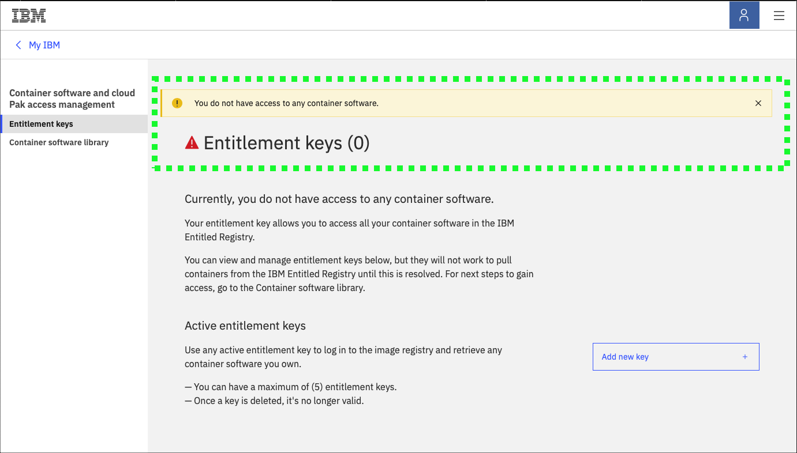
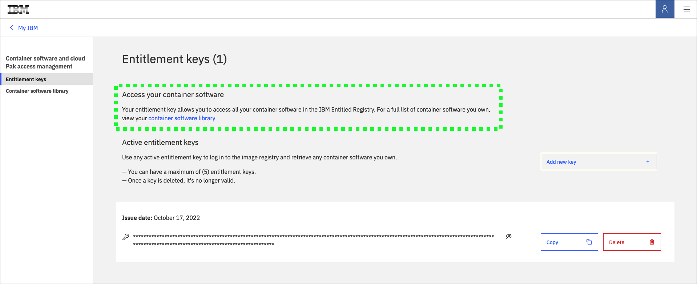
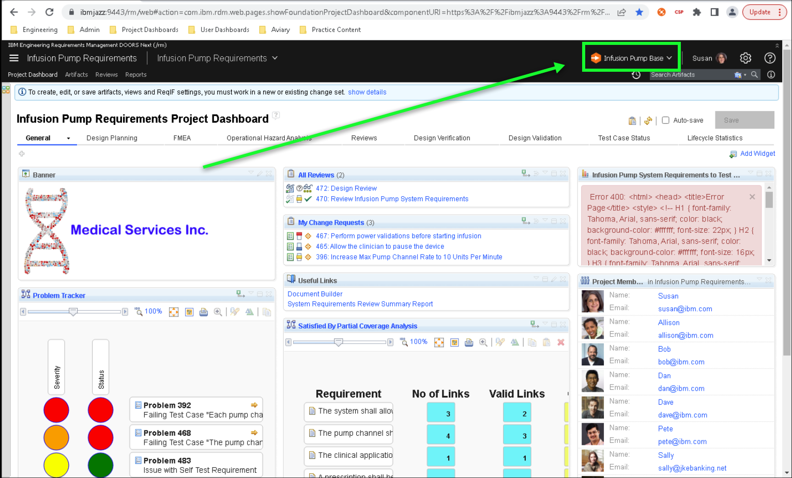
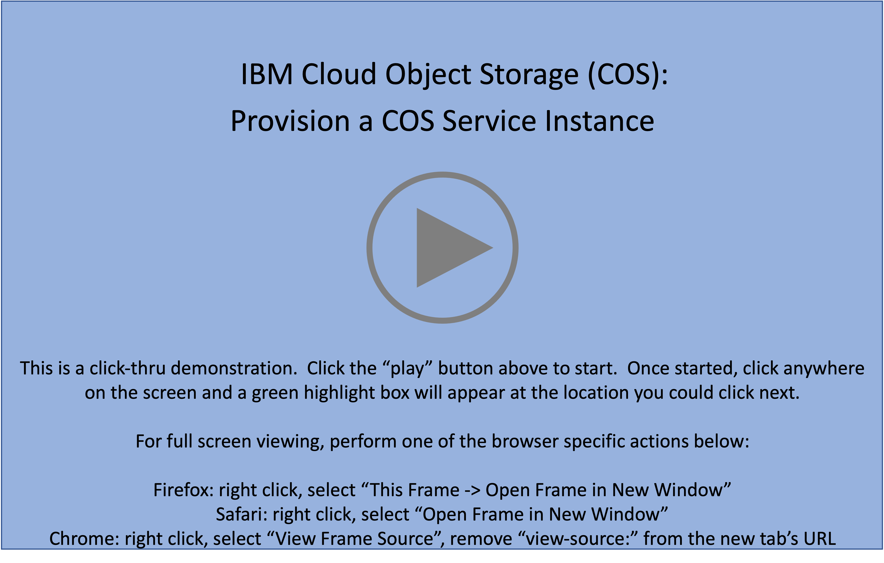
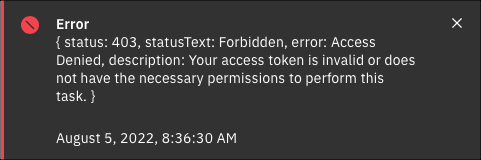

Welcome to the {{learningplan.name}} demonstration guide! The goal of this demonstration guide is to provide IBM and Business Partner technical sellers with the knowledge and tools to perform hands-on demonstrations of {{offering.name}}.

!!! danger "READ THIS BEFORE PROCEEDING"
    To complete this activity, users MUST have an **entitlement key** in the IBM Entitled Registry to access IBM container software (e.g. IBM Sterling B2B Integrator). Before proceeding, verify an entitlement exists.

    To verify entitlement to IBM container software, open the IBM **Entitlement key** page <a href="https://myibm.ibm.com/products-services/containerlibrary" target="_blank">here</a>. Note, authentication to ibm.com will be required. If a screen with a yellow warning as seen in the image below is displayed, you will **NOT** be able to complete this activity. IBM employees will need to open a IBM Cloud support ticket to request access. Business Partners can learn more about their entitlements <a href="https://www.ibm.com/partnerworld/program/benefits/partner-package" target="_blank">here</a>, and will need to speak with their IBM representative to resolve the entitlement issue.

    

    **If a valid entitlement exists, a screen similar to the one below should be displayed. The actual key will be created in a later step. lease proceed with the demonstration script.**

    

In addition to completing all the steps in this demonstration guide, to obtain the associated {{learningplan.name}} badge:

**IBM Technical Sellers** must develop and record a Stand & Deliver presentation. This video is intended to simulate delivery of a “live” demo in front of a client — on camera. IBMers will have flexibility in defining a hypothetical client, the pain points the client has, and the goals they aspire to achieve. The recording will then cover the seller’s hands-on demonstration and pitch to the client the value of the IBM solution using the environment and techniques of this lab. Specific criteria that must be demonstrated as part of the Stand & Deliver recordings is provided within the documentation that accompanies the Level 3 course in Your Learning.

**Business Partners** must pass an accreditation quiz after completing this demonstration guide. The quiz consists of multiple choice questions, with four possible responses (and only one correct answer) for each question. The quiz verifies use of the demonstration environment and not general knowledge of the offering.**Hint: keep the demonstration guide and the associated IBM Technology Zone (TechZone) environment active while completing the quiz. Watch for the "BP quiz question"  icon in the demonstration guide.**

Before jumping to the Demonstration Overview, please read the guidance below. **Reading and understanding the information will save time while completing the steps in this guide.**

## Recommended browsers

It is recommended to use either Firefox or Safari web browsers. There has been at least one instance reported using the Chrome browser and some popup menus not being populated and some popup dialogs not appearing. No testing has been done using the Microsoft Edge browser.

## Helpful tips for using this demonstration guide and environment

Throughout the guide, images are used to help guide students through the demonstration.

The following styles of highlighting are utilized in images:

- Action highlight box: Illustrates where to click, enter, or select an item:

- Path/explore highlight box: Illustrates one of two things:

    - the path to follow to get to a specific location in the user interface
    - areas to explore

<!-- To assist in navigating the browser-based user interface (UI), a **birds-eye view** of the UI is often provided. Expand these views by clicking on the **>** icon of the expandable section of documentation.

??? tip "Birds-eye view"
     -->

- Copy to clipboard box: The text is copied to the clipboard. Click the copy icon (highlighted below) and then paste using the operating system's paste function. For example, entering ++ctrl++**+v**, ++cmd++**+v**, or right-click and select paste.

<!-- Additionally, throughout the demonstration guide there are sample narration scripts. The short narratives can be utilized when performing client facing demonstrations. -->

<!-- !!! quote "Sample narration"
    In this demonstration we’ll see how an infusion pump was engineered using the IBM ELM solution, in alignment with industry standards like ISO13485 and IEC 62304 for development and ISO 14971 for risk management. We’ll break the demo up into four acts... -->

<!-- Additionally, there are several "click-thru" demonstrations. Links to click-thru demonstrations will open in a new browser window or tab with a screen similar to the image below.

Click the play button  in the middle of the screen to start the demo. Then, simply follow the steps in the demonstration guide. If unsure where to click, click anywhere on the screen and a highlight box will appear showing where to click next.

**In this demonstration environment, full access to the IBM Cloud account is NOT provided.** User identifications (IDs) will be restricted to specific capabilities. Permission to create or modify COS service instances, COS buckets, Key Protect instances, etc. is not provided.

!!! warning
    Attempting to perform an action without the appropriate permissions will result in an error message like the one below. This is not an issue with the IBM Cloud or COS, rather a restriction of the demo environment and the permissions assigned to users.

     -->

## Acronyms

The following acronyms are used throughout this demonstration guide:

    - Applicability Statement 2 (AS2)
    - Application programming interfaces (APIs)
    - Artificial Intelligence (AI)
    - Business Partner (BP)
    - Electronic Data Interchange (EDI)
    - IBM Sterling Business to Business Integrator (B2Bi)
    - IBM Sterling Partner Engagement Manager (PEM)
    - IBM Technology Zone (ITZ)
    - User Interface (UI)
    - Virtual Machine (VM)
    - Yet Another Markup Language (YAML)

It is now time to proceed to the Demonstration Overview.
